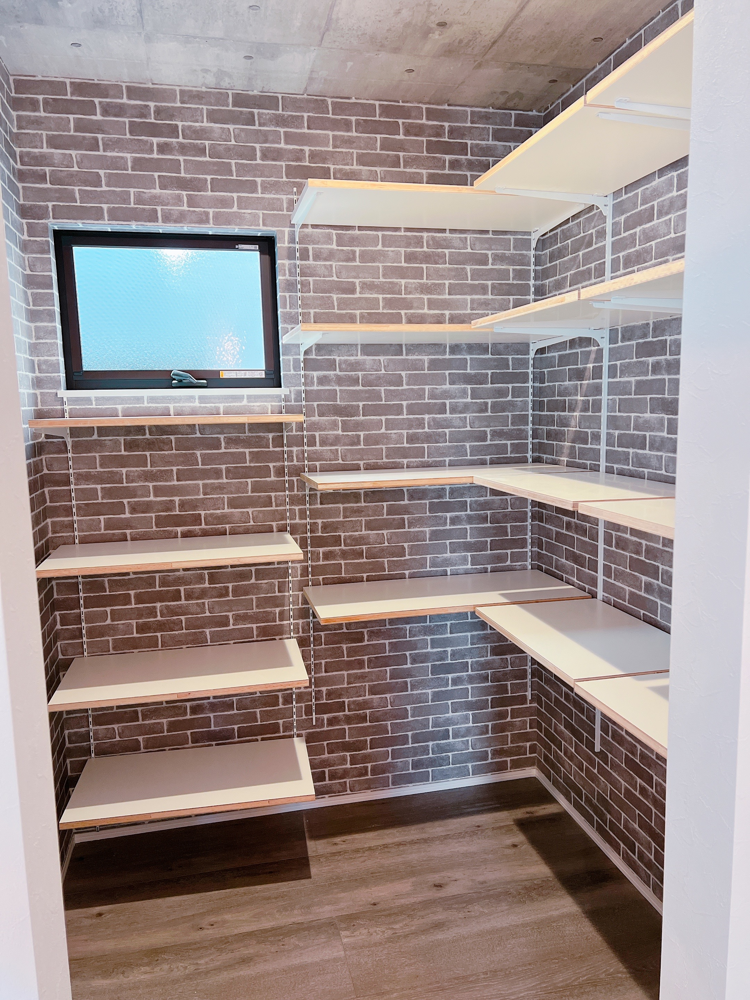

施主検査ってやつをやってきました。  
ただうちの場合はちょっと一般的な施主検査と違う形になってしまったので詳しく書いてみる。

## 施主検査とは

そもそも施主検査って何をするものなのか。  

- [引渡し前の施主検査・完成検査の立会いと注意点](https://www.anest.net/study/sesyukensa201906.html)
- [【2022年 決定版】プロが解説！新築戸建の施主検査・竣工検査のチェックリスト](https://www.sakurajimusyo.com/guide/20392/)

簡単に言うと施主である僕が建築中もしくは完成後にチェックして設計からずれたところはないかとか作ってみたらイメージと違ったみたいなのがないかとか、あとはもうちょっと細かい、電気通ってませんけどとかここ壁紙ちゃんと貼れてませんけど、みたいなそういうのをチェックする工程です。  
契約内容にもよりますが、完成後にこの施主検査で指摘しなかった点に住み始めてから気づいた場合、無料で対応してくれないこともあるので施主検査はめちゃくちゃ真剣に色々見た方が良い場になります。

色々なサイトで施主検査時のチェックリストを作ってくれているし、僕の場合は先に家を建てた友人が使ったチェックリストを共有してもらってそれを自分用にカスタマイズして使いました。

## 我が家の場合

ただうちの場合、工事が始まってから現在住んでいるアパートの更新が意外と近いことに気づいて、なんとかこの更新日よりも先に引き渡してくれませんかっていうお願いをしていて、結果的にはいけることになったんだけど外構工事は引っ越し後に行うし、引き渡しのときも一部の施工は終わっていない状態になっちゃうっていう感じだったので施主検査時点で完璧なものを見られる感じではなかった。

なので当然掃除もされていなかったし工事に必要な道具が家の中に転がっている感じの全然途中という状態で完成検査にあたる最後の検査をすることになってしまった。

とはいえ住み始めてから気づいたことも対応してくれるとのことだったので、そこらへんは安心できた。

## 様子

写真が下手すぎるのですが様子を残してきました。

## おわり

結構指摘ポイントがいっぱいあって、家中にマスキングテープを貼ってメモしてく感じだった。  
とは言え全体的にイメージ通りで最高すぎてめっちゃ興奮した。

正直本当に僕の好みすぎて色んな人に自慢をしたくて写真を載せている節がある。  
こだわりにこだわり抜いた注文住宅なので満足しないはずがないんだけど本当に大満足の結果になりそうで、ここに至るまでの工務店とのいざこざによるストレスが一切消え去って本当によかった。

あとはもう指摘したところを直してもらって引き渡しをするだけなのでいよいよって感じです。
