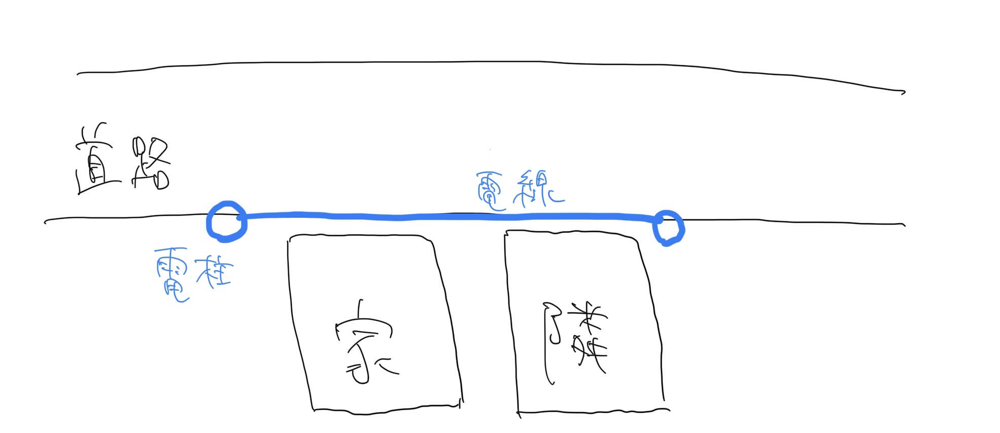
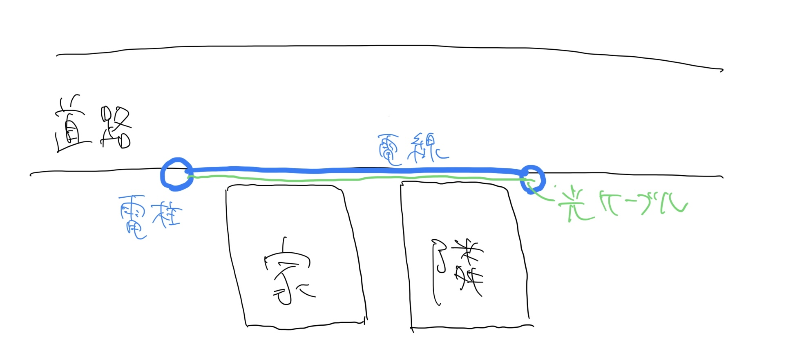
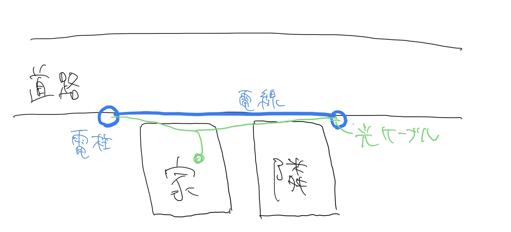
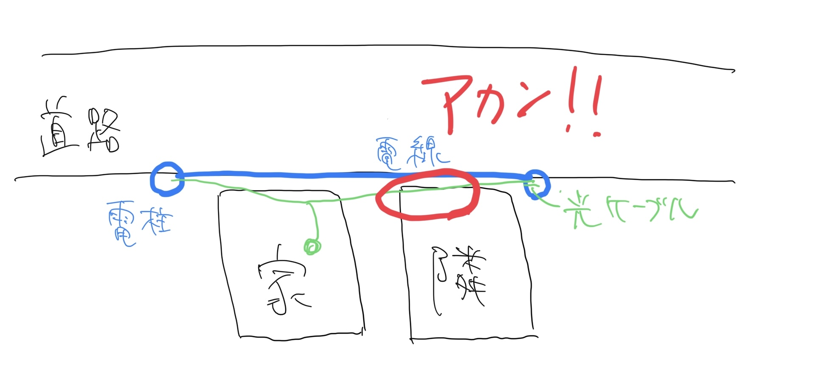
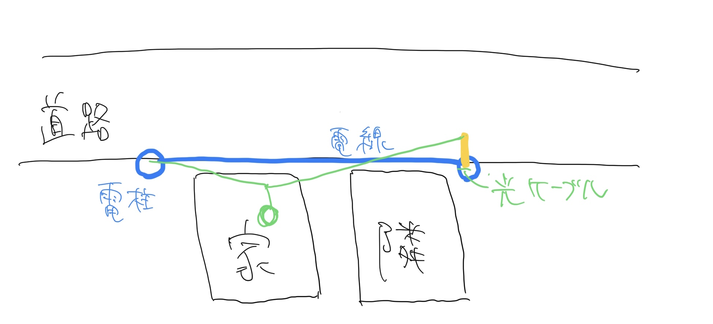
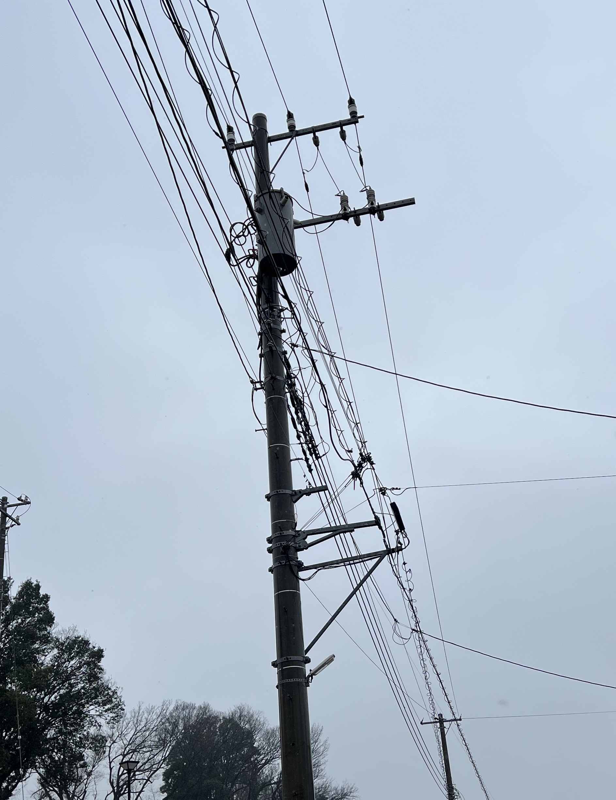

無事に新築注文住宅が完成して引っ越しを終えた僕ですが、光回線の敷設にめちゃくちゃ苦労したので今日はそこらへんの話を書いていこうと思います。  
結構がっつり書いていくので、今後家を建てる人の参考になればと思います。  
今回の話の対象は戸建て住宅であり、アパートやマンションの場合はわりと簡単に済むパターンが多いと思います。

## 引っ越しの2ヶ月前に準備をしていた

まず何があったかという話ですが、1/26に引っ越して光回線が使えるようになったのが2/21でした。1ヶ月弱使えなかった状態になります。ただなんかこう書くとたった1ヶ月かいという感じがありますが、僕にとってインターネットは水と同じでありこの1ヶ月間地獄のように苦しんでいました。  
また前提として、僕が何も知らずになんの準備もせずのらりくらりとやっていた結果こうなったというわけではなく、用意周到に準備していたのにも関わらず世の中の非合理によってこのような状況になったという話です。

どれくらい用意周到だったかというと引っ越しの3ヶ月前には光回線に関する計画を立てて、2ヶ月前には NURO 光に申し込みをしていました。

## 引っ越し当日までの流れ

ここからは具体的になぜ引っ越しから1ヶ月弱光回線を引けなかったのかというのを時系列順に書いていこうと思います。  

### 引っ越しの3ヶ月前

新居の光回線の計画を立て始めました。  
回線業者選びから家の中の配線計画まで、同僚のネットワークに詳しいエンジニアに相談しつつわりと綿密な計画を立てました。  
結果的に光回線は NURO 光に申し込むというわりと無難な選択になりました。

### 引っ越しの2ヶ月前

NURO 光は工事日の2ヶ月前から予約申し込みが可能なので、引っ越し当日を工事日に設定して予約申し込みをしました。  
NURO 光は屋内工事と屋外工事で2回の工事が必要で、通常は屋内工事が終わった時点で屋外工事の予約申し込みをするので結構時間がかかってしまいます。ただ申し込み時に同日工事オプションというのが選択できて、それを選択すると工事日を1日にまとめることができます。僕もそのオプションで申し込みをしました。

ちなみに新築住宅の場合、まだ家が完成していない段階で光回線の業者に工事に入ってもらって引っ越し当日にはすでに光回線が引かれている状態を作ることも可能なのでは、と考えて工務店に相談したのですが、そういうのは何かがあったときに責任の所在が難しくなってしまうということで断られてしまいました。

その後、わりとすぐ NURO 光から工事日確定の連絡がきてこの時点で僕は勝利を確信しました。  
しかし工事日確定から1週間ほど経ったところで NURO 光から再び電話がきました。ここから地獄の釜の蓋が開かれることになります。

現地に事前調査に入ったところ、家の周辺環境が理由で屋外工事を同日で行うことができないという連絡でした。  
詳しい事情を聞こうにもあまり詳細を話してくれず、とにかく引っ越し日に屋内工事をして結局それが終わった時点で屋外工事の申し込みができるようになるという NURO の通常パターンに入ってしまうとのことだったので、引っ越し当日にインターネットが使えないなどということは許容できない僕としてはこの時点で NURO 光の申し込みをキャンセルしました。

次の策として、 NURO 光に負けない速度を売りにしている回線業者を探して、結果的に「au ひかり ホーム10ギガ・5ギガ」に申し込みをしました。  
すぐに申し込みをしたので引っ越し日での工事の予約が間に合いました。その際に1回の工事でインターネットが使えるようになることを確認して、僕は再び勝利を確信しました。

### 引っ越しの1ヶ月半前

au ひかりから電話がきました。  
現地調査を行ったところ、家の周辺環境が理由で工事が簡単にはできないと言われました。 NURO 光と全く同じ展開です。  
詳しく話を聞くと、うちに光回線を通すために近くにある電柱の工事が必要なのだがその電柱が他人の私有地にあるのでそこの住人に許可を取らなければならない、ということでした。

電柱が私有地にあるからといって電柱は別にその人のものではないし許可を取らなければならないなんてことは聞いたことがなかったし、何を言ってるのかよくわからなかったので色々質問したのだけれど、電話してきた方もあまり詳しく把握していないようで疑問が解消することはなかったです。  
この時点でわかったことは au 光の開通センターと工事業者はそこまで綿密にコミュニケーションしているわけではなく、開通センターはとにかく結果だけを聞かされていて詳しい内容を伝えられてないっぽいということ。

そしてとにかく住人に許可を取って工事を進めていくので進捗があり次第連絡します、ということでした。

### 引っ越しの1ヶ月前

そこから1,2週間待ってもなんの連絡もなかったのでいよいよ不安になってきました。  
ここから僕は3日に1回のペースで au 光開通センターに電話をすることになります。まあ毎回なんの進捗もありませんと言われるだけだったのですが。  
許可を取りたい住人とコンタクトを取ることができなくて…ということを毎回言われていました。具体的に何をしているんですか？と聞くとそのお宅に訪問しているが毎回留守で、工事の許可を取りたい旨の手紙をポストに入れているがなんの連絡もない、ということでした。

それって住人次第で僕はもう詰んでませんか…？

そんな日々がしばらく続いて業を煮やした僕は、僕からそのお宅に訪問するのでどこか教えてくださいと伝えたのですが、それは個人情報なので…と言われて断られてしまいました。  
とにかくあなたはひたすら待っていてください、ということでした。

そんな感じでこちらから電話をかけまくる日々をしばらく送っていると、ついには申し込みしていただいた工事日に工事ができなそうな見込みですと言われてしまったので、もうあかん…という気持ちになり一旦諦めて並行して別の回線業者を探し始めました。  
au ひかりに電話をするのはこの時点でやめて後で話す別の業者に申し込みをしたのですが、その後しばらくして au ひかりから申し込みした工事日に間に合わないことが確定したという連絡がきたのでそのときにキャンセルしました。  
au ひかりの開通センターの話の通じなさに僕はめちゃめちゃいらついていたのですが、まあ工事業者とプロバイダーとでしっかりコミュニケーションできていないんやな…という気持ちになりました。

### 引っ越しの2週間前

じゃあここから何をするのかということですが、ここで一旦光回線のシステムについて軽く説明します。

光回線の事業者はフレッツ光系と独自回線系があります。  
多くのプロバイダーはフレッツ光の回線を利用して光回線を提供しています。 NURO 光や au ひかりは独自回線を使って光回線を提供します。

この違いが結構重要で、フレッツ光はすでにめちゃくちゃ多くの建物で利用されていて、日本中の電線にフレッツ光の光回線が通っているので比較的簡単に家に回線を通すことができます。ただ、利用者が多いことによるデメリットもあって、多くの回線業者が同じ回線網を利用しているので速度が遅いです。これが僕に取ってはなかなか厳しい。

NURO 光や au ひかりは独自回線を使うのでフレッツ光系に比べると速度が出やすいのがメリットです。  
しかし、独自回線を使うことになるので、フレッツ光系の工事に比べて追加で必要な工事があるために回線が使えるようになるまで時間がかかる、などのデメリットがあります。

今回僕は回線速度を重視したため NURO 光や au ひかりを選んだのですが、多分そのせいで特殊な工事が必要になり引っ越し当日に間に合わない状況になってしまったのかなと推測しました。
我が家が簡単に回線を引き込めない立地にあるっぽいことは伝わったのですが、具体的に何がだめなのかは詳しく教えてもらえていない状態でした。

ということで、この時点で僕は回線速度は一旦諦めてフレッツ光系の回線業者を申し込むことにしました。  
フレッツ光系であれば比較的工事が早く、すぐ使えるようになる可能性が高いので、今回はその中でもドコモ光をプロバイダーとして選びました。

ただ調べてみると、ドコモ光はスマホをドコモで利用していないと店頭に行って直接のやりとりをしないと光の申し込みができない、ということだったので、すぐにドコモショップに向かいました。  
そこで店員さんに、これまでの NURO 光と au ひかりでの困ったポイントを事細かに説明して、ドコモ光さんに申し込んだ場合はちゃんと予約した工事日で確実にインターネットを使えるようになるのでしょうか？というのを念押しして確認したところ、上で書いたような回線網の話をされた上でフレッツ光系であればそのようなことが起こる可能性は限りなく低いので安心してください、ということを伝えられました。

もちろん「限りなく低い」だけなのでドコモショップの方も100%とは言っていないのですが、安心してくださいという感じだったので僕も安心して申し込みをしました。  
ただもうその頃には引っ越し日がわりと近い日になってしまっていたので、引っ越し日である1/26には工事が間に合わず、2/3に予約という形になりました。  
引っ越しから1週間後の工事になるので、1週間インターネットで使えないということになるので、その間仕事ができないのは困るのでドコモが提供している[home 5G](https://www.nttdocomo.co.jp/home_5g/)の申し込みをして、それで1週間を凌ぐことにしました。

これは家に置いてコンセントに挿すだけでドコモの回線を使って Wi-Fi を飛ばせるというもので、5Gエリアであれば理論値としては光回線に負けない速度が出ますよ、というものです。  
月額料金と、デバイス自体の料金がかかるのですが、幸いにも同僚がデバイスを持っていて、それを格安で譲ってくれたので月額料金だけで申し込みができました。  

ということでこの時点でスケジュールが確定し、引っ越し後1週間は home 5G でなんとかやりくりしてその後は光回線を使える、という流れになりました。

### 引っ越し当日

1/26 になって引っ越しをしました。  
すぐに home 5G の接続テストをしたのですが、予想はしていましたが5G提供エリアではなかったので理論値をはるかに下回って下り100mbps、上り20mbpsくらいでした。  
とはいえ仕事は普通にできるくらいの速度だったので3日間ほどは快適に仕事ができました。しかしやはりドコモの電波を使用するので、多くの家庭がインターネットを利用する平日の夜や土日は全く速度が出ず、わりとそこらへんは不便でした。

そして4日目以降に異変が起こります。  
これまで遅くとも20mbpsくらいは出ていた回線が、ついに下り1mbps, 上り0.5mbpsくらいしか出なくなりました。  
さすがにこのレベルだと全く仕事にならなくて、 zoom での通話で僕だけみんなの声が3秒遅れで聞こえるとか画面共有するとまともに画面が見れなかったり、突然接続が切れて zoom が落ちたりなど、なかなか厳しい状況でした。

色々調べてみると、使用量無制限とでかでかと書いてある home 5G ですが、小さく注意書きがあって「3日間の使用量があまりにも多いと通信制限が入ります」という旨のことが書いてありました。  
詐欺では…？という気持ちにはなりましたが、まあしょうがないとしてとりあえず色々ググってみたのですが、そんなに同じ状況で苦しんでいる人はなかなか見つからず、本当に通信制限なのかどうかの判断ができませんでした。

この使用量の閾値というのはどれだけ多くの人がエリア内で使ってるかなどによって変わるので明確な値を出すことができないようで、こちらで推測するのも不可能な状況でした。  
ただ、僕が働いている開発チームは1日中 zoom を繋いで画面共有をしてモブプロをし続けるチームなので、1日の使用通信量を見ると150GBをゆうに超えるレベルだったので、そのレベルで3日間使ってるとさすがに通信制限されるっぽい雰囲気を感じました。

そういうわけで僕は会社への出社を余儀なくされてしまいました。  
リモートワークになって出社の必要がなくなったので東京を出て遠くに引っ越したのに会社に通う日々が始まり、僕は一体何をしているんだ…と毎日思い悩み、精神状態が不安定になってました。

### 引っ越し1週間後

2/3を迎えて待ちに待った工事日になりました。  
インターホンが鳴ったとき僕は救世主が来たかのように心を躍らせて工事業者の方を迎えたのですが、そこで衝撃の事実を伝えられます。

家と電柱の位置の問題で本日工事ができません、と。  
またドコモの開通センターに状況を伝えるので連絡を待ってください、と。

膝から崩れ落ちました。  
工事業者の方がめちゃくちゃ申し訳なさそうにしていたので責めるに責めれなかったのですが、何がだめなのかということを詳しく教えてくれました。

図で説明します。

我が家と隣の家、そして電柱の位置関係はこのようになっています。

この状態で我が家に光ケーブルを通すためには、まず電柱の間に電線とは別で光ケーブルを通さないといけないです。  
:point_down: こんな感じで。

前提として電柱のどちらかに光ケーブルが届いていないといけないのですが、うちの場合はすでに届いていました。  
届いていない場合は届いている電柱から引いてこないといけません。

そして、この電柱の間を通している光ケーブルから引っ張っておうちまでケーブルを通します。  
:point_down: こんな感じ。

ここで大事なのは光ケーブルをうちに入れようとすると、電柱の間を通っているケーブルを少し引っ張ることになるというところです。  
そうすると、隣の家の敷地の上空を少しかすめることになります。

これが問題になります。  
全然知らんかったけど人の敷地の上空を通るのはいけないことらしい。

ここで気づきましたがこれまで NURO 光と au ひかりの工事が止まったのはこれが原因だった説があります。  
ここで取れる対応としては2つあって、まず1つ目がこの敷地の人に許可を取ること。

思えば au ひかりの人は電柱の工事の許可ということを言っていたのですが、そうではなくて上空を通ることの許可だったようです。  
しかし全く応答が得られなかったので進まなかったのではないかと予想しています。

それに対して、ドコモ光の工事業者の方が教えてくれた対応方法は :point_down: これです。

電柱にこの図の黄色い突起をつけて、道路側に光ケーブルのスタート地点を移動させます。  
その上でうちまで引っ張ると、引っ張られた状態でも隣の家の敷地の上空を通らなくなります。

これはわりとよくやられている対応で、街中のいろんなところで見られます。  
:point_down: こういうやつ。

これは想像なのですが、ドコモ光はフレッツ光の系列で、フレッツ光は NTT なので他の回線業者よりも電柱の工事がスムーズにできるから、隣人に許可を取るよりもすぐにこの選択を取れるんじゃないかなと思いました。

そして話は戻って、このような説明を受けて、この工事をするのには時間がかかるのでまたしばらく連絡を待ってくださいということでした。  
こういう工事は特にこちらへの連絡がなくいつの間にか行われて、それが終わったら再び我が家に光ケーブルを通すための工事の予約を受け付けるようです。

### 引っ越し2週間後

そこからは毎日家の前にある電柱を眺めてはいつ工事が来るのかな…と憂う日々でした。  
そんな日々を1週間ほど続けると、ようやくでっかい工事用の車両がやってきて電柱の工事を始めているのを目撃しました。  
あまりの嬉しさに工事のおじさんと雑談を楽しんでしまいました。

その翌日、ドコモ光の開通センターから電話が来て、再び工事の予約を取ることができました。

### 引っ越し3週間後

工事当日を迎え、今回こそは本当にインターネットが使えるようになりました。  
これでついに僕の地獄の日々が終わりを告げました。

### 現在

我が家の LAN 環境は事前にしっかり計画を立てていて、家の設計の段階から良い感じに配線できるようにしていました。  
ONU から有線ルーターで受けて、それを自分、妻、子の部屋とリビングに向けて壁内を Cat6A のケーブルで通して、各部屋で有線接続できるようにしています。  
また無線 LAN は、リビングから Google Nest Wi-Fi に LAN ケーブルを挿して、そこから飛ばしています。2階にも Nest Wi-Fi の拡張ポイントを置いています。

そんな感じで現状は上りも下りも調子良いときは 400~500mbps ほど出る環境になりました。  
これが幸福…。

## 学びとして

もう多分人生の中で引っ越しをする機会っていうのはないと思うのですが(多分。いやあるかも…？)、そのときに役に立ちそうなことをまとめておきます。

- 家を建てる際に電柱と隣人の家の位置関係をよく見ておく
  - 近くの電柱に光ケーブルが来ていなかったり、来ていてもそこから家に繋げようとしたときに他人の敷地上空を通るかどうかを把握する
    - 光ファイバーの線かどうかの見分け方はこういうのを見るとわかります
      - [住宅地の電柱に張られたケーブルが、電話用か光ファイバーか電力用の何の種類なのか、見分ける方法は？](https://jp.quora.com/%E4%BD%8F%E5%AE%85%E5%9C%B0%E3%81%AE%E9%9B%BB%E6%9F%B1%E3%81%AB%E5%BC%B5%E3%82%89%E3%82%8C%E3%81%9F%E3%82%B1%E3%83%BC%E3%83%96%E3%83%AB%E3%81%8C-%E9%9B%BB%E8%A9%B1%E7%94%A8%E3%81%8B%E5%85%89%E3%83%95%E3%82%A1)
    - 他にも道路を挟むとか、川を挟むとかになると工事がめっちゃ大変になります
- 家の完成の前に光回線の工事を入ってもらえないかを確認する
  - 建築業者の方は高確率で嫌がると思いますが、完成前に準備ができているのが一番というのと、光回線の工事ができるかどうかが早い段階でわかるという良さみがあります

言うてこれくらいしかなさそうだった。  
僕の辛い日々を読んでくれた誰かに少しでも役に立ったら嬉しいな〜と思います。

終わり。
