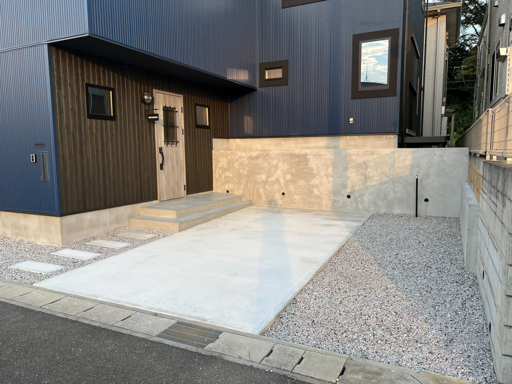
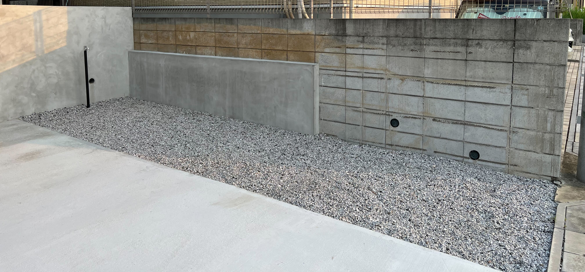

前回マイホーム記事を書いたのが2ヵ月前なので、もう完全にこのシリーズを終えた気になっていたのですが、実は外構工事は中途半端な状態で引っ越しをしていました。  
というのも引っ越しスケジュールや予算の問題で、引っ越し後に工事を行ってもらうものや引っ越し後に別の業者に依頼して別で作ってもらうものなどがあったという感じです。

そんなわけで、引っ越し当時の残タスクとしては駐車場・玄関周りの工事と、1階ウッドデッキの工事の2つがありました。  
今回は駐車場・玄関周りの工事がやっと終わったよ～～という報告です。  
(ウッドデッキの方は別の業者に今見積依頼中)

## こんな感じになりました

ここまで長く引っ張っていたのは、コンクリ部分を綺麗にするための左官工事が全然日程組めなくて放置されてしまっていて、それがやっと先日終わったという感じ。  
正直、外構にかけられる予算が全然なくて本当に最低限の体裁を保つくらいの設計になりました。

特に車を2台以上所持する予定がないので駐車スペースは車1台入れば良い程度の広さで、コンクリ以外の部分は全て砂利で埋められています。  
防草シートの上に砂利を置いているので草が生えてこないと思いきや、防草シートを突き破って雑草が生えてきやがるので3ヵ月に1回くらいのペースで草刈りをしています。  
右側にある黒い棒は水道の蛇口なんだけどこの半年間この水道は一回も使ったことがない。

本当はもっと緑を入れたかったりとかやりたいことがいっぱいあったのですが全然できていなくて、ここらへんはまた落ち着いて再びお金の余裕が生まれてきたら良い感じの業者を見つけて庭を改造していこうと思います。

現時点結構辛い部分があって、お隣さんとの敷居がブロック塀になっているんだけどそこがあまりに汚くてどうしようかなって思っている。

左下当たりの綺麗になっているところは土がむき出しになっていた部分で、そこはこちらで埋めた。  
一回こっちで高圧洗浄機とかで掃除をしてみようとは思いつつ、それで綺麗にならなかったら左下にやっているようなコンクリの処理を全体まで伸ばすか、草木を植えて隠すかなんかはしたいなあと思っている。

## おわり

次回はウッドデッキあたりの話を書きたいと思っている。  
あと内装のお気に入りの部分の話とかもしていきたい。
