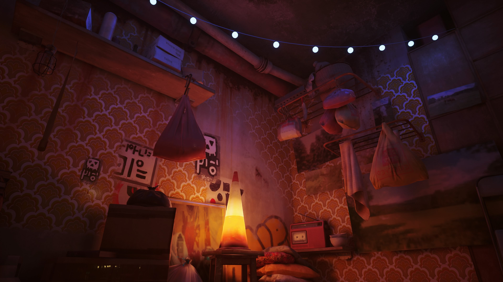

巷で話題の最高に癒される猫ゲー『[Stray](https://store.steampowered.com/app/1332010/Stray/?l=japanese)』をクリアしたので感想を書いてみる。

## 感想

最高に良かった。  
世界観の作りこみが本当に素晴らしくて、人間がいなくなった後のロボットだけが存在するサイバーパンクっぽい世界を猫になって放浪するんだけど、街の様子や家の中のインテリアとか、雰囲気が本当にこだわって作られているのがわかる。

癒されるゲームだと聞いてたけど、正直癒しのピークはゲームの一番最初だった。  
後半になると、癒しを求めてやってきた人たちを苦しめる展開になっていくのでそこは注意が必要な気がした。

寝れるスペースがいろんなところにあるんだけど、そういうところで寝ているとどんどんカメラが遠くなってその場所全体を映すようになっていく演出がすごい良くて、このゲームはゆっくりゆっくり進めようという気持ちになる。

アクションっぽいものとか謎解きっぽいものとか、いろんな要素が入っていてフィールド全てをよく歩かないと集めきれない探索要素もあって最後まで飽きずに進められた。  
フィールドは平面的ではなく立体的な構造になっていて、いろんな建物の上を渡り歩くのも猫を主人公にしている特性をしっかり活かせていて良かった。

色々詰め込まれてはいるゲームだけど、プレイ時間としては10時間くらいでやりきることができるので、手軽に濃密なゲームをやりたいというときにはとてもおすすめできるゲームだった。

最後にめっちゃ気に入っている場所をいくつか。

