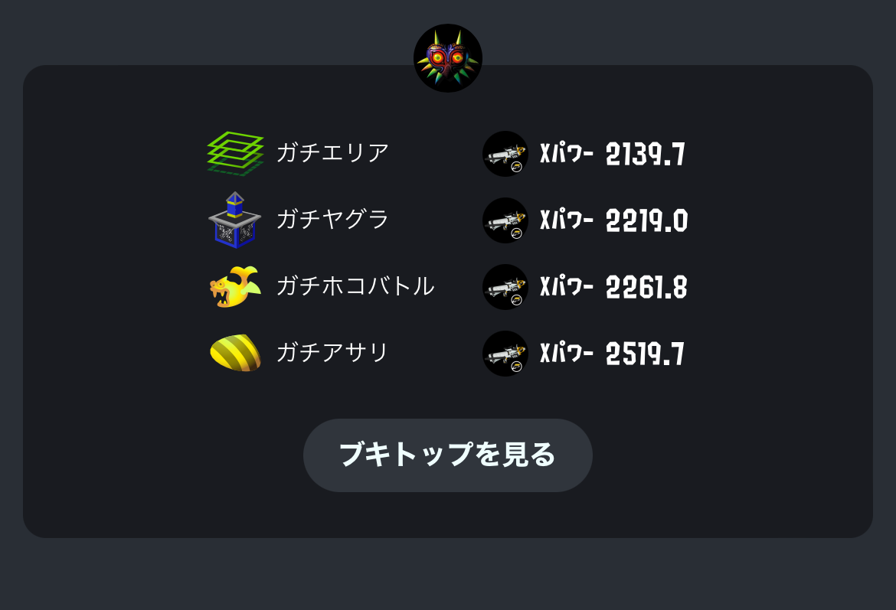

スプラトゥーン3が発売されて3ヶ月の月日が経ちましたね。そしてXマッチが解禁されて1週間の月日が経ちました。

ここ3ヶ月の僕はと言えば、愛する持ちブキであるプライムシューターがラインマーカーというオモチャを持たされ、それでも僕の愛を止めることはできないのでラインマーカーコンボを極めるため日々ラインマーカーのエイムの特訓を繰り返しておりました。  
個人的にスプラトゥーン3は2よりも圧倒的に面白く、またなぜだかわからないが全然イライラしないゲームになっていたので、ガチスプラプレイヤーには劣るものの並々ならぬプレイ時間を積み上げていました。

そしてXマッチが解禁されて1週間、イライラしないと思っていたスプラトゥーン3は完全に消え去りました。  
僕は理解しました。イライラの原因は全て上がり下がりするレートにあったのだということを。

スプラ2をやっていたときに既に経験済みだったこととして、スプラのストレスにより家族とのコミュニケーションに悪影響が出てしまう、ということがありました。  
あのときの危機とそしてそれを乗り越えた(というかあんまりスプラをやらなくなった)経験を加味し、またスプラトゥーンはエンジョイにとどめてプレイ時間を減らすか…と、僕はそんなことを考えました。

## 大愚和尚との出会い

そんな折、いつものように YouTube を徘徊していた僕はこんな動画に出会いました。

`youtube:https://www.youtube.com/embed/EoNA4LGaT0w`

感動しました。それはもうすこぶる感動しました。  
この大愚和尚という方は存じ上げなかったのですが、感動のあまりに思わずそのままこの方のやっているメルマガに登録しそうになりました。  
ただ僕はまだ社会がキラキラして見えていた大学1年生の頃、津田大介さんに憧れて彼の有料メルマガに登録しつつも結局1つも読まなかった失敗があったので、その反省を活かし今回はメルマガ登録を回避することができました。

話を戻すと、この動画の質問者であるハルマーさんは「何に対しても本気になれず、何かをやりきったという経験がなく、全てが中途半端」だということでした。  
ああ…これはまさに今の僕の姿…。そんな気持ちになりました。  
これに対する大愚和尚の回答が素晴らしかったのですが、それはまあこの記事の主旨と関係ないので気になる人は見てもらうとして、僕はこんなことを思いました。

**僕はまたスプラトゥーンから逃げるのか？**

と。

## 命を燃やせ by みおちゃん

話は変わりますが、僕がリリースを心待ちにしている [BLUE PROTOCOL](https://blue-protocol.com/) というゲームがあります。  
かれこれ3年ほどリリースを待ち続けていたのですが、このゲームがついに2023年早春にリリースされることが決まりました。

3年待ち続けているくらいなので僕はこのゲームに絶大なる期待を寄せています。多分実際にリリースされてクソゲーだった日には悪質なバンナムアンチになってしまうんじゃないか、というくらいには楽しみにしています。  
そうなると当然リリース後はスプラトゥーンに時間を割くことができなくなってしまいます。

つまり僕のスプラトゥーン生命は長く見ても残り約5ヶ月…。  
僕は思いました。この残り短い命、燃やし尽くすべきなのではないか？と。

## 頑張ってXPをあげようと思います

というわけで残り5ヶ月ほど、XPを上げるためにできることを色々試しつつ、アンガーマネジメントもしつつ、真剣に向き合っていくぞという気持ちになっています :fire:

1週間ごとに振り返りつつ何かしらのトライを出すみたいなのを続けていこうかなと思ってます。  
毎週日曜くらいに振り返りたい。

まず現状として、スプラ2では最高XPは2530とかそこらへんでした。  
どのルールも大体毎月2300後半から2400前半で落ち着いて、調子が良いときは2500タッチする、みたいな感じ。

スプラ3のXPは現状こんな感じです。

アサリは調子が良かっただけですね。(6連勝したらXPが150くらい上がった)

使うブキはプラコラで固定していこうと思ってます。無印とは打って変わって恵まれたサブスペを与えられたプラコラちゃん。  
目標は明文化しても微妙な感じがしますが、一応は2600乗せたいとかそんな気持ちはありつつも、まああまりそこにはこだわらずに毎週何かしらトライして変化を加えていきたいくらいな感じです。  
あと大切なこととしてストレスを貯めて家族に迷惑をかけることはしない、というのがありますね。

そんな感じで。おわり。
