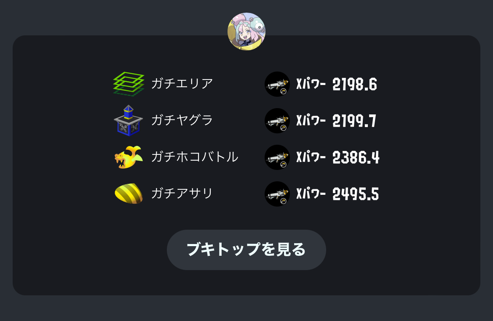
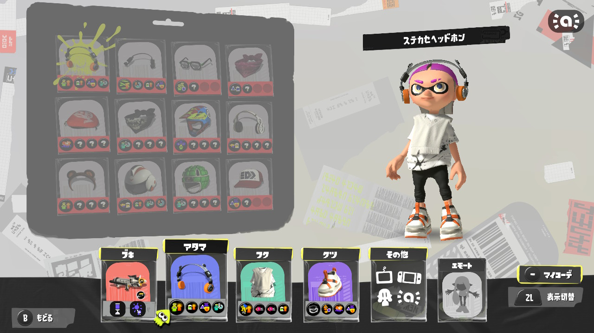
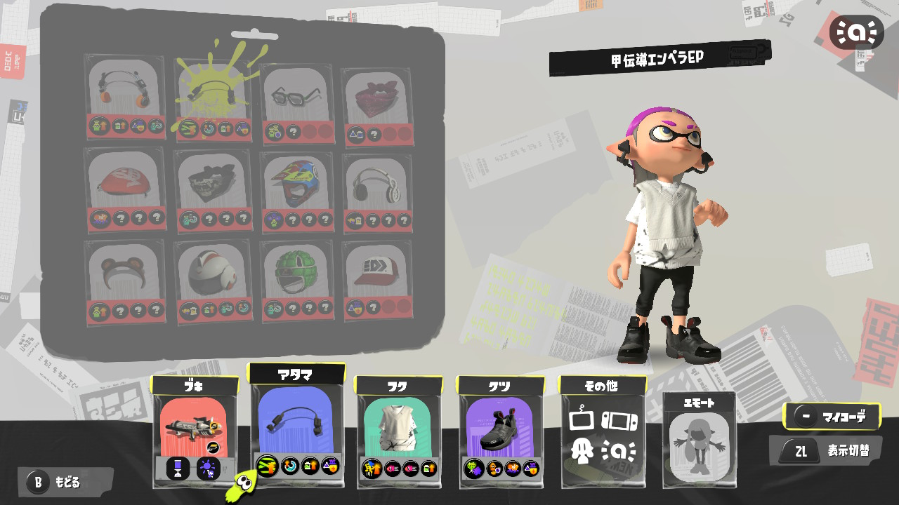

前回スプラトゥーンやっていくぞ！という話を書いてからスプラトゥーンをほぼ毎日やって、ギアが決まったり進捗が出たりなどしたので、そういう話をします。  
毎日できなかったのは子の寝かしつけをしてそのまま眠ってしまったパターンですね。これは不可避。

## XP 進捗

増減で言うと以下の感じです。

- エリア: +59
- ヤグラ: -20
- ホコ: +125
- アサリ: -24

全て合計の XP の増減でいうと、+140なので、まあ成長はしたということで良いでしょう。

マイナスしたものだけもう少し具体的に振り返ります。

ヤグラに関しては、いっときは結構上がったのですが、一度7連敗くらいしてしまってそれでめっちゃマイナスになって、結果-20になってしまいました。  
3連敗まではしょうがない感じの負け方だったのですが、振り返ってみると4連敗目以降はメンタル的な問題で悪手を選択してしまったような感じがあります。本来ならば打開でスペシャルをしっかり貯めてから前に出る動きをするものを突っ込んでしまったり、仲間にあわせて前に出たりスペシャルを吐いたりするところを自分のタイミングだけで動いてしまったりなど。  
ここらへんは自分のメンタルの弱さが問題ですね。負けが混むとストレスで平常時と同じ動きができなくなる。

アサリに関しては、正直あんまりわからずです。  
2500乗ったあと、一度連敗して-100くらい落ちたのですが、そこからまたある程度上げて2495で着地した感じ。  
味方が強くてキャリーされて勝つこともあるし味方が弱くて負けることもある、みたいな感じで、味方が弱いときにキャリーできる感じではないんですよね、このレベル帯だと。全然無双できない。  
このレベル帯での安定した勝ち方がわからないので、多分やっぱり僕の適正がまだもうちょい下なんだろうなあという気持ち。

## プライムシューターコラボのギアについて

個人的にプライムシューターに必須なギアはアクション強化かなあという感じ。  
あまりブレないプライムでもジャンプ撃ちは実は結構ブレて、それがなくなるだけでだいぶ対面性能があがります。  
ただこれを何個積むかっていうのが問題で、今の所僕はメイン1個分だけ積んでいます。本当は1.2くらい積んでも良い気がしているんだけど、他のギアとの関係で1だけに抑えています。

で、現状の僕の汎用的なプラコラのギアはこちら。  
(ギアの表記は39表記で進めます)

- カムバ
- ステジャン
- アクション強化 1.0
- イカ速 0.2
- インク回復 0.2
- サブ影響軽減 0.2
- スペ減 0.1
- ジャン短 0.1
- 安全靴 0.1

基本的にはこのギアでほぼ全てのルルステ対応できます。  
ただこのギア使ってて思うのは、安全靴とイカ速があと0.1ほしいなあ〜〜〜っていうので、ただもう他に抜いていいギアがないんですよね。強いて言えばサブ影響軽減を0.1にしても良いかも？とは思っているのですが、やっぱり巷ではサブ影響軽減は0.2にすることでクイボやスプボムの色々を防げるっていうあれがあるのでなかなか抜きづらい。  
ただ2とは違い爆減ではないのでスペシャルに対して効果がないっていう点で、実際のところ本当は抜いても良いのかもしれない…ただシャーカーが跋扈してる現状、クイボがガンガン飛んでくるのでやっぱり抜きづらいなあ〜〜みたいなところでこの型に収まっています。

で、ルルステによって頭のギアと足のギアをたまに変えたりしています。  
それがこちら。

頭のギアがカムバックからラストスパートになっていて、足のギアがステジャンから対物になっています。  
あと細かいところですが、スペ減0.1がスペ増0.1に変わっています。それ以外は全部一緒。

これは別に頭と足をセットで変えるというわけではなくて、頭だけ変えたり足だけ変えたりしています。

カムバックではなくラストスパートにしているのは、やっぱりエリアの終盤でキューバンボムをひたすら投げまくってカウントを取りきったり無理やり打開したりするためですね。  
正直カムバつけてキューバンボム投げまくる戦術は実際まじで強いです。なのでエリアだけじゃなくてヤグラで使っても良いかなあとは思っていますが、まだ実戦ではエリアでしか試していないです。

次に足ですが、ステジャンではなく対物を使うパターンで、これはわかりやすくステジャンが特に活きない狭いステージとかでどうするかっていう話で、現状はカニタンク一強時代なので対物つけてキューバン投げることですぐにカニを消せるっていうメリットを取っています。

これは相手にシャーカーが常に一人は確実にいることを前提にしているので、環境が変われば対物が必要なくなるときはそのうちくるかもですね。

以上。おわり。
