早いものでこの家に引っ越してきてそろそろ1年が経とうとしています。  
概ね新居には満足していますが、いくつかしんどみを抱えていることがあって、その中の一つが庭の雑草問題です。

[「#13 外構がほぼ完成した【家を建てる話をするシリーズ】」](/2022/08/my-home-13/)に書いたように駐車場は業者に外構工事に入ってもらったので、コンクリート面以外は防草シート + 砂利敷きという形になっています。  
が、それ以外の家の周りは土のまま放置されていました。その結果まあ雑草がめちゃくちゃ生える…。

特に夏は本当にひどくて、うちの雑草がお隣さんのフェンスを侵食してさらに奥にある花壇に攻撃をしかけていて軽く注意されてしまいました。ごめん、本当に。  
それからというもの定期的に雑草抜きをしているのですが、それが本当にしんどくて雑草抜きをやるとその後しばらく腰が終わります。

とりあえず現在の様子を見てもらいましょう。  
今は冬なので夏に比べるとだいぶ雑草も弱弱しい感じではありますが、それでも全然生えています。

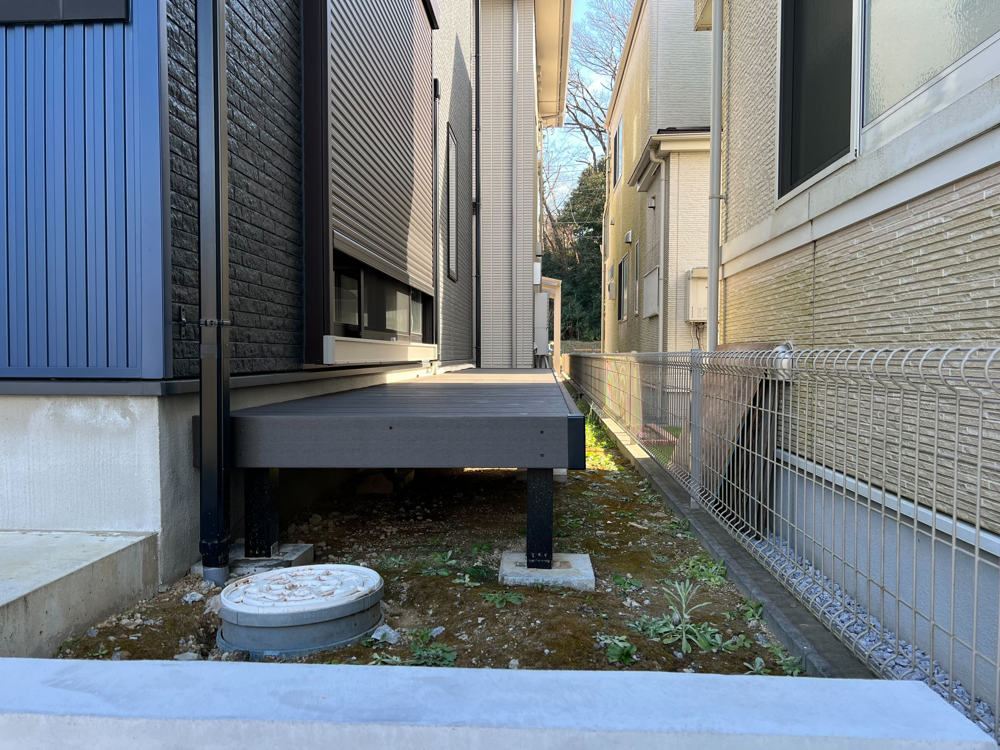

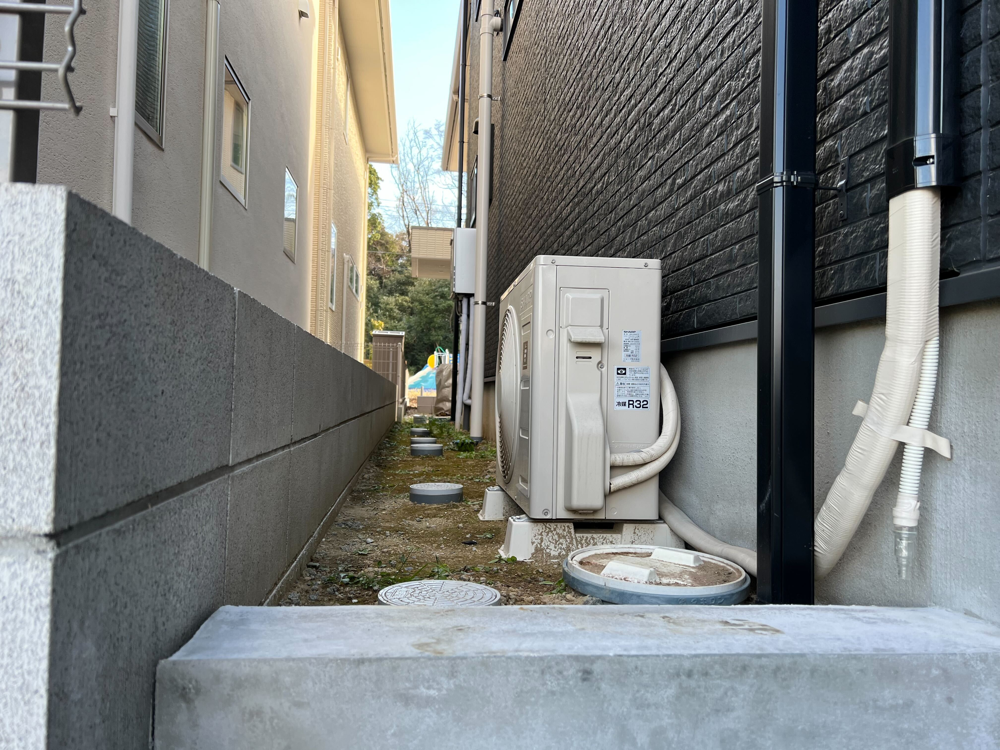

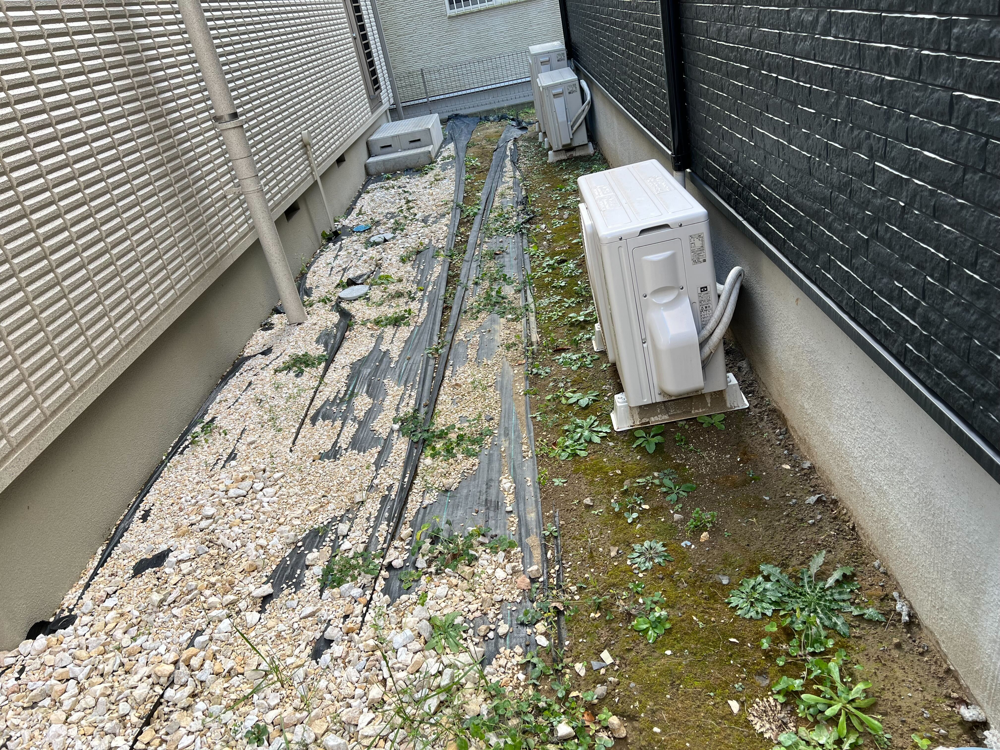

(ていうか家の裏手は、現状裏の家との間に仕切りを入れてないんだけど、裏の家の人の防草シートと砂利が雑すぎて我が家に浸食している。)

もうさすがに1年間雑草抜きをやって嫌になってきたので、雑草対策をしようという気持ちになりました。  
実は我が家、まだお隣さんとの間にフェンスをつけていなくてリビングの窓からお隣さんの庭が丸見えで、シャッターを閉めておかないと大変気まずいという問題もあって、以前に業者に依頼して防草シート + 砂利 + フェンスで見積もりをとってもらったところ120万くらいかかるということでお財布的に厳しく一回流れたことがあります。  
その見積もりの中で、防草シート + 砂利の処理は10~20万ほどで、それくらいだったら自分でやることで安く抑えられるんじゃないかという気持ちになりました。

ということでやってみました。

## かかった金額

家の近くのケーヨーD2で防草シートやら砂利やらレンガやら諸々の道具やらを買い込みました。

かかった金額はこんな感じ。

- 防草シート: 4,928円
- 防草シート用のピンや接着テープやボンドなど: 8,370円
- レンガ: 3,200円
- 砂利: 25,681円
- その他道具: 13,218円
- 合計: 55,397円

業者に見積もりをもらった額の半分以下なのでだいぶ安くすみました。うちにスコップとかハンマーとかがなく道具も諸々買ったので、それがもともと家にあったら1万円くらいは節約できた。  
ちなみに対応した地面の面積は25平米ほど。

## 手順その1 雑草と石を撤去して土をきれいにする

まず最初の工程として、防草シートを敷く前に地面を綺麗にしないといけないです。  
ボコボコだったりすると防草シートに穴が開きやすかったり、砂利を均等に並べるのが難しくなったりしてしまうので。

ということでやりました。  
途中で小雨に振られて死にそうな思いをしながら半日かけて今生えている雑草を根っこから消し去りつつ邪魔そうな大き目の石を撤去しました。あとは軽く土を掘ってならしてふわふわにしています。

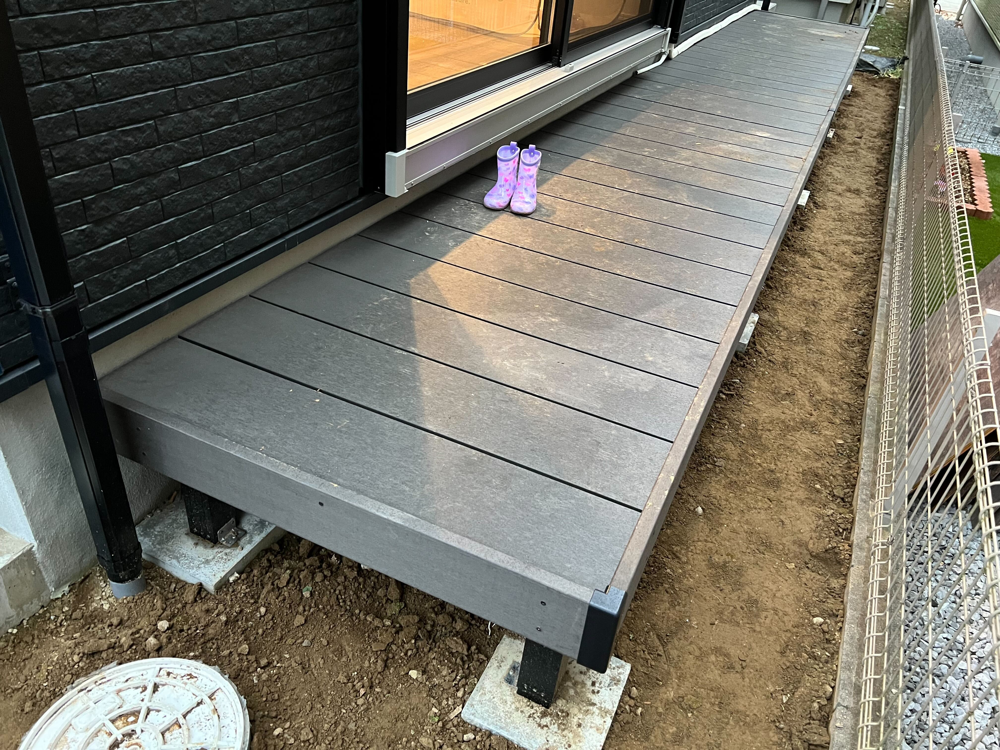

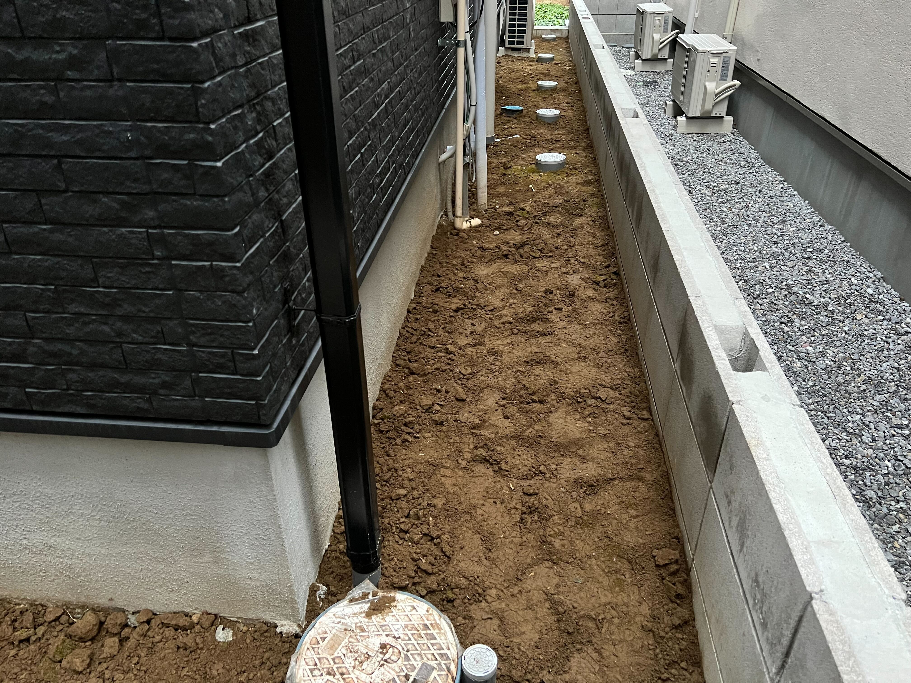

ウッドデッキの下にも少し草が生えていたり石がごろごろ落ちていたりして、うつぶせになりつつウッドデッキにもぐりこんで処理するのが本当にしんどかった。  
そしていっぱい出てきた石の処遇に困っていたりする。調べたところうちの地域では石はゴミとして出せないらしく、専用の業者に依頼するしかないみたい。

この後の工程としては、もう少し土をならした後に転圧することで土を良い感じします。  
ただうちには転圧機がないのでスコップをうまく使って頑張って転圧してました。

## 手順その2 防草シートを敷く

これが一番しんどかったのですが、土の上に防草シートを敷きました。

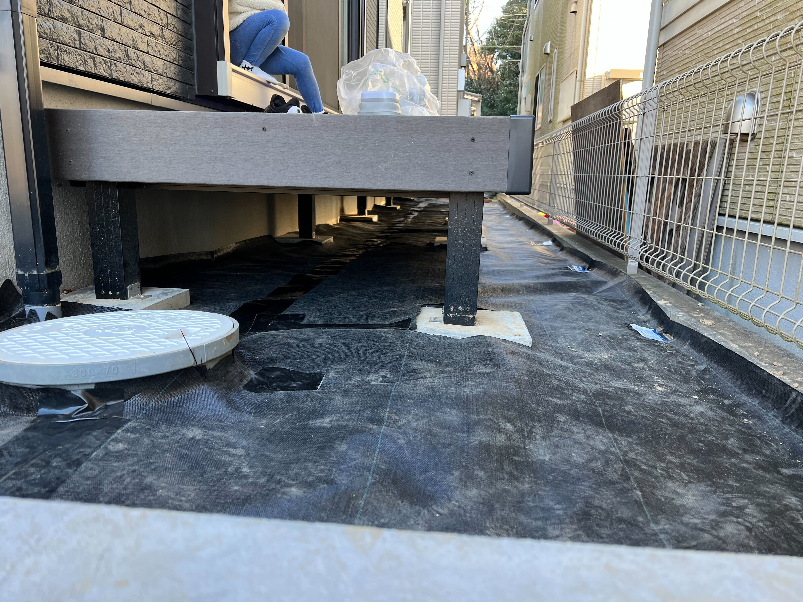

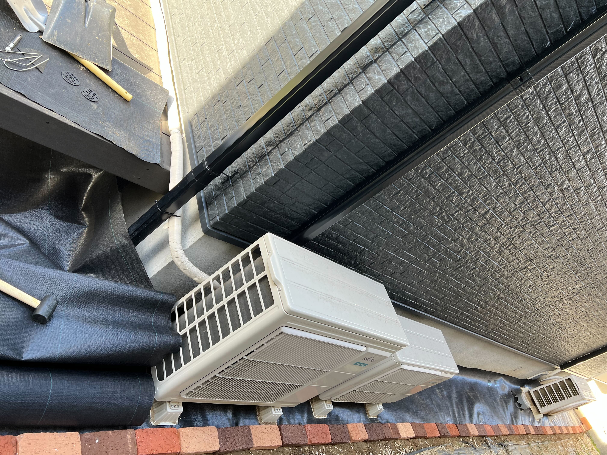

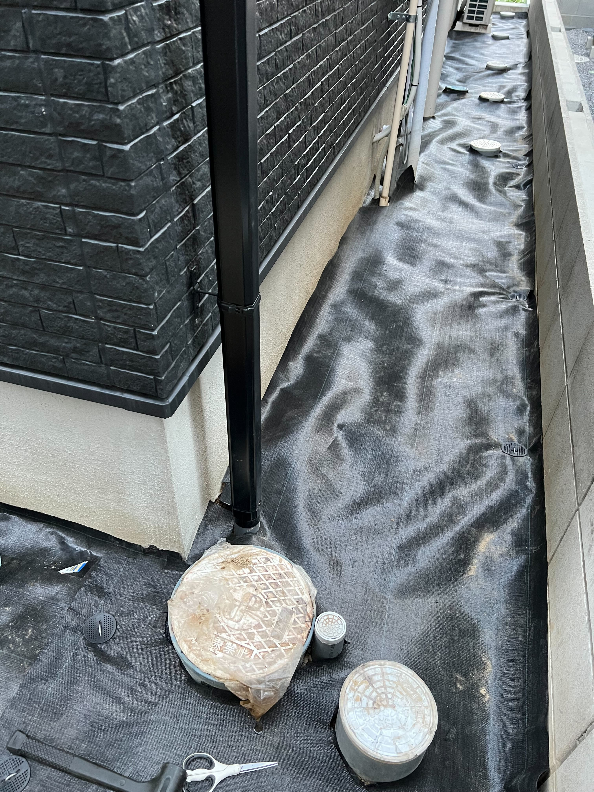

何が大変ってウッドデッキがすでに置いてあるので、このウッドデッキの足が干渉してしまうので防草シートをうまいこと切りながら敷いていくのが本当にきつかったです。  
ウッドデッキの下に匍匐前進でもぐりこんで防草シートを貼っていく作業が地獄でした。

他に大変だったのはマンホール的なやつがあるたびにシートを丸く切ったりとか、エアコンの室外機の下に敷くために室外機を持ち上げたりとか。

防草シートをうまく敷くために YouTube でやり方を見まくって覚えたことで今回注意したこととしては、

- 防草シートを重ねる際は10cmほど被せる
- 防草シートが重なる部分は全て防草シート用のテープで止めて隙間を作らないようにする
- ピンを打つ際に地面に通ってる配管にあたると詰むのでしっかり確認する
- ピンを打ったら上から防草シート用のテープで穴を塞ぐ
- 防草シートが壁に沿う部分は、2,3cmほど余白を作って砂利でその部分が隠れるようにする
- 防草シートが家の土台に沿う部分は、防草シート用のボンドで壁に接着する

とかとか。

家の裏手は、裏の家の土地との間に敷居がないので、レンガを並べて敷居がわかるようにすると同時に砂利を並べたときに裏の家の土地に砂利が飛び出ないようにした。

## 手順その3 防草シートの上に砂利を敷く

あとはひたすら砂利を敷いていくだけです。

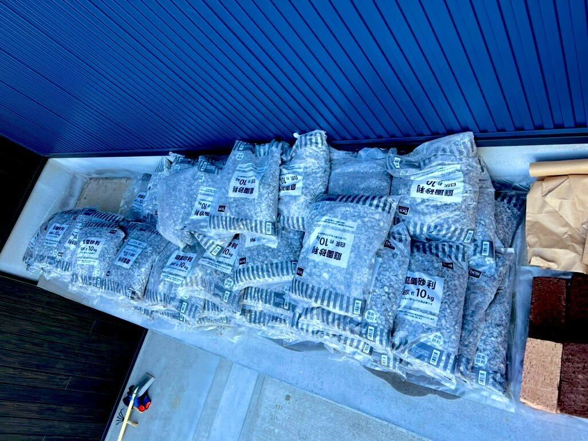

10kgの砂利の袋を75袋買ったので、750kgの砂利を用意しました。  
この重量はさすがに車で1回で運ぶことができないので、ケーヨーD2で購入後4回に分けて家に運びました。

袋から出して砂利をならすという作業を75回やった結果がこちら。

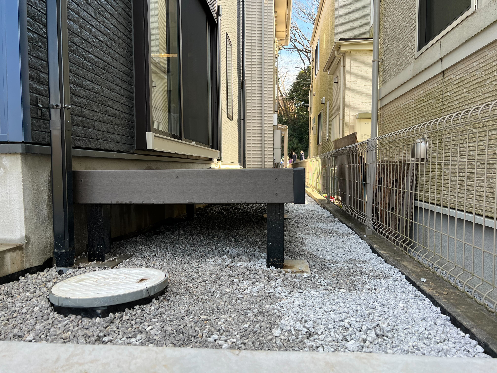

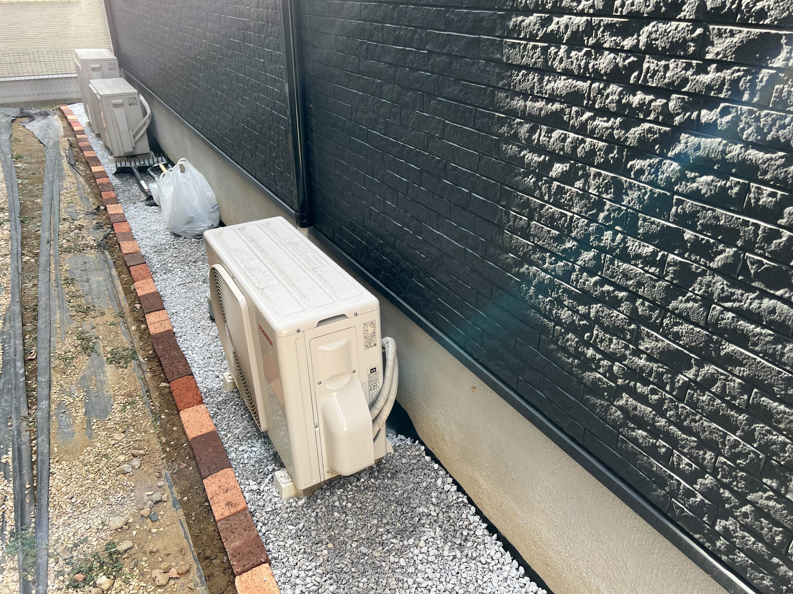

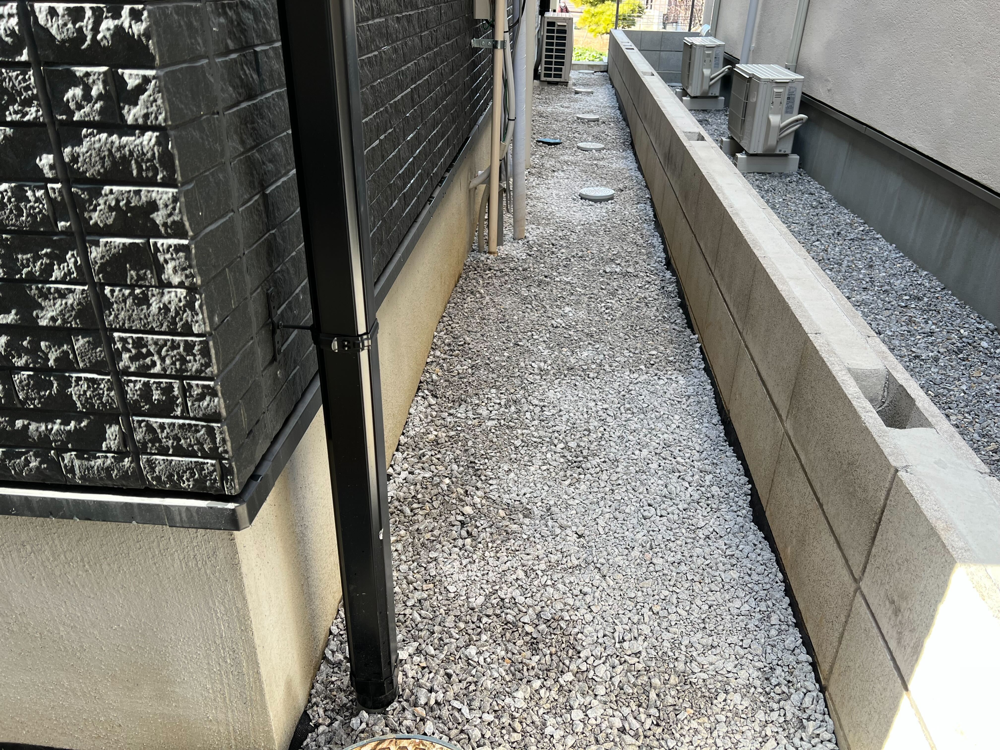

だいぶ良い感じになりましたね。

## 反省点

とりあえずやりたいことをやりきることはできたのですが、いくつか気になりポイントが残りました。

### 壁に沿う部分で防草シートが見えちゃってる

砂利を敷いた写真を見てもらうとわかるのですが、防草シートがはみ出しています。  
見栄え的に若干気になるのでなんとかしたいのですが、対応としては見切れた分を切るかもっと砂利をかさ増しして見えないとこまで上げるって感じなんですが、体力的にも金銭的にも限界を迎えたので一旦放置することにしました。

### 室外機の裏やウッドデッキの下が結構適当

パット見だと見えないところは砂利を入れてなかったり入れていてもめっちゃ雑だったりしています。  
これはめんどくさかったっていうのとあと普通に砂利が足りなくて、目に入らないところはまあいっかってなった結果です。

### そもそも砂利が足りていない

砂利の上を歩きながら砂利を蹴ったりするとわかるのですが、砂利の厚みが薄くてすぐに防草シートの黒い部分が見えてしまいます。  
多分追加であと300kgぐらいは砂利がないと全ての地面を良い感じにすることはできないので、また気になってきたらいつか砂利を追加しようと思います。

## 感想

2週間にわたって土日を使って作業して、時間にすると多分20時間くらいやった気がする。妻と2人でやったので10人時ですね。

出来としては微妙な点も残るものの初めての作業にしてはきれいになったので概ね満足です。  
とにかく砂利を安く手に入れたかったので砂利の見た目に関しては妥協しました。結局まだ砂利が足りてないので、いつか砂利を追加するときはもうちょっと見栄えが良い砂利を上に重ねる感じにしたいなあと思っています。

防草効果に関しては今年の夏を越えてみないとわからないので、10ヶ月後くらいに効果はどうだったかというのをまた書こうと思います。

ちなみに僕も妻もこの2週間の作業により体がくたくたになってしまったので業者に依頼する場合の半額以下に収められたとしても結果良かったのかどうかは正直わからないところですね。  
最近 YouTube でひたすら DIY の動画を見ていて自分でもやってみたいなあと思っていたので今回は自分でやることに踏み切ったのですが、良い経験にはなりました。

この勢いでウッドフェンスも DIY できるんじゃねえかとちょっと考えてるんですが、今回の作業よりもさらに難易度が上がるので今は YouTube でウッドフェンス DIY の動画を見まくって研究しているところです。

以上、おわり。
