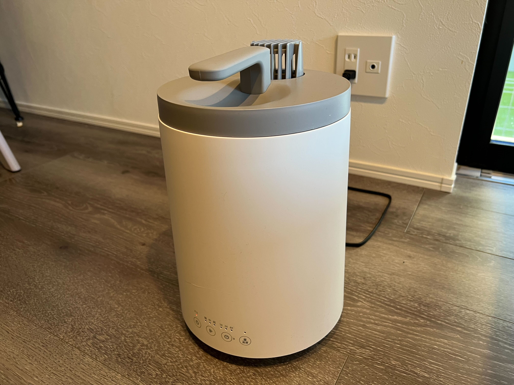
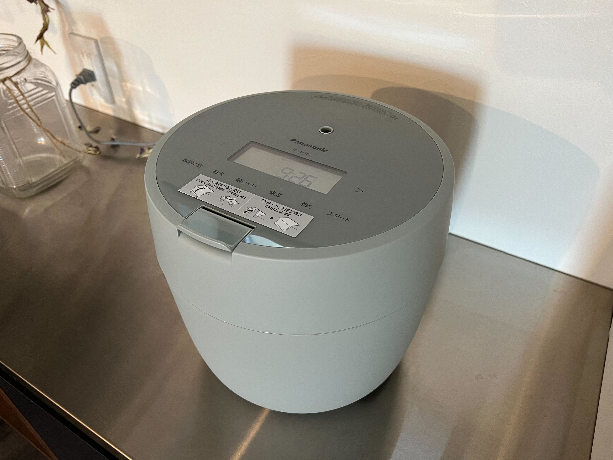

## 今月のトピック

### 筋トレが順調に進んでいる

1月から始めた筋トレを毎週継続して回数目標を達成できている。  
今月の3週目だけ体調が悪くて少しノルマに足りなかったけれど、他は問題なくこなせている。  
特に体に影響はまだ全然ないんだけどきっと半年くらい続けたら何かしら良い影響が出ると思うので、まだまだ続けていく。

毎週少しずつ回数も増やしているので、来月も引き続き回数を増やしていきたい。理想はワンパンマン・チャレンジに到達することで、毎日腕立て100回・腹筋100回・スクワット100回・ランニング10kmをやることなんだけど多分その域に達するのに1年くらいかかりそう。

### ついに貯金を始められた

これまでの人生、まともに貯金ができたことのなかった人生だけれど、ついに今月から貯金をし始めた。  
先月からやり始めたお金の勉強の結果、支払い用のクレカを諸々整えたり銀行口座も諸々整えたりをやったので、後は毎月確実に貯金していくことと稼ぎを増やしていくことをしっかりやっていくぞ。

借金返済も結構良いペースで進んでいるし、お金の不安が少しずつ減っていて気持ちが良い。  
はよ借金も返済しきって投資を始めていきたい。

### 家電が2つも増えた

今月は家電の出費がでかかった。

1つ目は、加湿器。  
もっと冬の早い段階で買えよという話だけれど、めんどくさくて買ってなかった。妻にめっちゃ催促されたので YouTube でいろんな人がレビューして褒めていたドウシシャの加湿器を買った。  
スチーム式でめっちゃ掃除がしやすいやつで、湿度が上がると共に部屋の体感温度もめっちゃ上がって、家の中が暖かく感じるようになったのでとても良かった。

[ドウシシャ 加湿器 | Amazon](https://amzn.to/3Z4D9FL)

2つ目は、炊飯器。  
これは加湿器を買った少しあと、うちにあった炊飯器が急にまったく動かなくなってお亡くなりになってしまったので急いで家電量販店に行って買った。  
これまで使っていた炊飯器は妻と一緒に住む前から妻がずっと使っていたもので、もう10年ほど使い続けていたみたい。  
買ったのは Panasonic の炊飯器で、正直見た目がかわいいだけで選んだものだったんだけど、炊飯時間が短くなったし色んなモードで炊けるようになったし満足している。

炊飯器が変わったことによる米の味の違いは正直全然わからなかった。

[Panasonic 炊飯器 SR-NB102-G](https://amzn.to/3ZsvRLO)

### 臨時収入が多かった

今月は毎月の給与に加えて、まず賞与があった。  
そしてそれに加えて先月やった確定申告の還付金が入った。さらに言うと一昨年書いた書籍の印税が半年に1回のタイミングで入ってきていて、それがあったっていうのと、児童手当も振り込まれたので、臨時収入がめっちゃ多かった。

入ったお金のほとんどを借金返済と貯金にあてたのと、あと今月は家電の出費も大きかったので特に個人的なご褒美的なものは何も買えなかったんだけど、これだけ収入があるとめっちゃうれしい気持ちになる。

この感じを毎月味わいたいのでやはり個人事業の収入を得たいと心から思うのであった。

### Honda e を試乗した

ずっと乗ってみたかった Honda の EV である Honda e に試乗してきた。

<blockquote class="twitter-tweet">
Honda e 試乗してきた。外観かわいいしフロントパネルすごいしサイドミラー中に映っててすごかった〜〜 <a href="https://t.co/pmUCTE3y46">pic.twitter.com/pmUCTE3y46</a>
&mdash; nabeliwo (@nabeliwo) <a href="https://twitter.com/nabeliwo/status/1629658428112265216?ref_src=twsrc%5Etfw">February 26, 2023</a></blockquote> 

EV のデメリットとか、Honda e 自体の微妙な点とかもいろいろあるんだけど、それを吹っ飛ばすくらいに外観・内装のかわいさと乗りやすさと圧倒的なガジェット感によってめちゃくちゃ体験が良かった。

本当に買いたいんだけど、Honda e は EV の中でも若干高めだし、補助金を加味しても今の僕じゃ全然変える状態にないので、買いたい気持ちだけ募らせて一旦諦めることにした。

正直結構早めに車を買いたいんだけど、初めての車は多分カーローンを使わず安い軽を中古で買うことになるんじゃないかな～って思っている。

## 個人開発

1月進めていた個人のプロジェクトや勉強は4つあった。

- 少人数のチームで進めているアプリ開発
- 1人で進めているウェブサービス開発
- Ruby on Rails の書籍を使った勉強
- Blender の Udemy を使った勉強

このうち、少人数のチームで進めているアプリ開発以外の3つが止まってしまった。アプリ開発の方に多く時間を使った結果なんだけど、やっぱりここまでの数を並行して進めるのは厳しかった。  
YouTube の活動の方も使う時間が増えてきたので、いろいろと取捨選択しないと何も達成できなくなってしまう。

ただ Rails の方は、最近仕事で Rails 力が全然足りてないことを実感しているのでプライベートの時間でもっと勉強したい気持ちはあるんだけどなかなか進められていない。  
これは来月なんとかしないといけない気がしている。

## YouTube 活動

今月は動画を2つ出せた。  
先月のふりかえりで、動画を1つしか出せなかったと書いたんだけど、実はふりかえりを書いたすぐ後にめっちゃ頑張ったら1月内に出せたので、1月も2月も月2本ペースを守れたことになる。

ただ一応先月は1件しかふりかえりに動画を載せられなかったのでここで3件載せる。

- [めちゃくちゃかっこいいゲームボーイ互換機『Analogue Pocket』を買った！ - YouTube](https://www.youtube.com/watch?v=B40wRqPPHVA)
- [頑張りすぎないデスク周りの配線整理術 - YouTube](https://www.youtube.com/watch?v=iFWX4WkgmKk&t=2s)
- [【デスクツアー】白デバイス好きがこだわり抜いた仕事も趣味も完璧にこなせるデスク環境のご紹介【テレワークに最適化】 - YouTube](https://www.youtube.com/watch?v=AxGJ_2XvEWk&t=23s)

3件とも僕の動画の中ではだいぶ伸びていて、それに伴って2月はチャンネル登録者が結構良いペースで増えていてとても嬉しい。ただ他の伸びている YouTuber を見ていると、やはり毎日投稿をやり始めてから登録者が爆増したりしているので、投稿頻度もっと上げていきたいなあとなっている。

年内に少なくとも月3ペースの投稿を維持できるようにはなりたい。  
ストレッチ目標としては週1にしたい気持ちがある。仕事をしつつ趣味での動画投稿だとこの辺りが限度そう。

ただ今月の YouTube 活動は1つ反省点もあって、Analogue Pocket の動画で出した「ゼルダの伝説 ふしぎの木の実」のカートリッジが明らかに海賊版のもので、動画に合わせて Amazon のレトロゲームショップで買ったんだけど偽物を掴まされてしまった。  
問い合わせしたら返金してもらったしめっちゃ謝罪されたんだけど、そもそも動画に出す前になぜ自分でそれが本物であるのかを確認しなかったのか、という後悔がある。  
まあそもそもゲームを Amazon で買って偽物が届くという発想がなかったんだけど、事前にプレイしてちゃんと動くことは確認したのでそれで満足してしまっていた。  
(海賊版は中身のデータは本物のデータを吸い出して書き込んでいるのでゲームはできるんだけど、カートリッジ自体が適当なやつを使っている)

動画公開してから「偽物じゃん…」っていうコメントが来て気づいたんだけど、それでめっちゃ焦って謝罪コメント載せたりなどの対応をした。  
結構へこんだんだけど、まあ今後気を付ければ良い話だし動画にコメントがつくこと自体が嬉しいので今は切り替えられている。

動画で扱うコンテンツの信頼性はちゃんと担保しつつこれからもやっていくぞという気持ちになった。

## 良かったコンテンツ

- 『ようこそ実力至上主義の教室へ 2年生編 9巻』を読んだ
  - 僕の中で今一番熱いラノベの最新刊
  - この後にまっている大盛り上がりのための準備が少しずつ始まっている感があってめちゃくちゃ楽しみになった
- 『幸福の「資本」論 あなたの未来を決める「3つの資本」と「8つの人生パターン」』を読んだ
  - 感想は別記事にまとめた
  - [『幸福の「資本」論 あなたの未来を決める「3つの資本」と「8つの人生パターン」』を読んだ | ナベリヲログ](https://blog.nabeliwo.com/2023/01/read-kouku-no-shihonron/)
- 『ホグワーツ・レガシー』を始めた
  - 約束された神ゲーが本当に神ゲーですごい
  - まだ10時間くらいで、一生サブクエをやっている
- 『ゲーム』を見た
  - [ゲーム : 作品情報 - 映画.com](https://eiga.com/movie/11244/)
  - どんでん返し系の映画を定期的に見たくなるので色々調べて辿り着いた
  - ずっとハラハラしつつ最後に一気に感情を持っていく感じがとても良かった
- 『ブラックパンサー／ワカンダ・フォーエバー』を見た
  - とてもとても悲しい作品なんだけど今後のために区切りをつけて整理した感じの内容だった気がする
