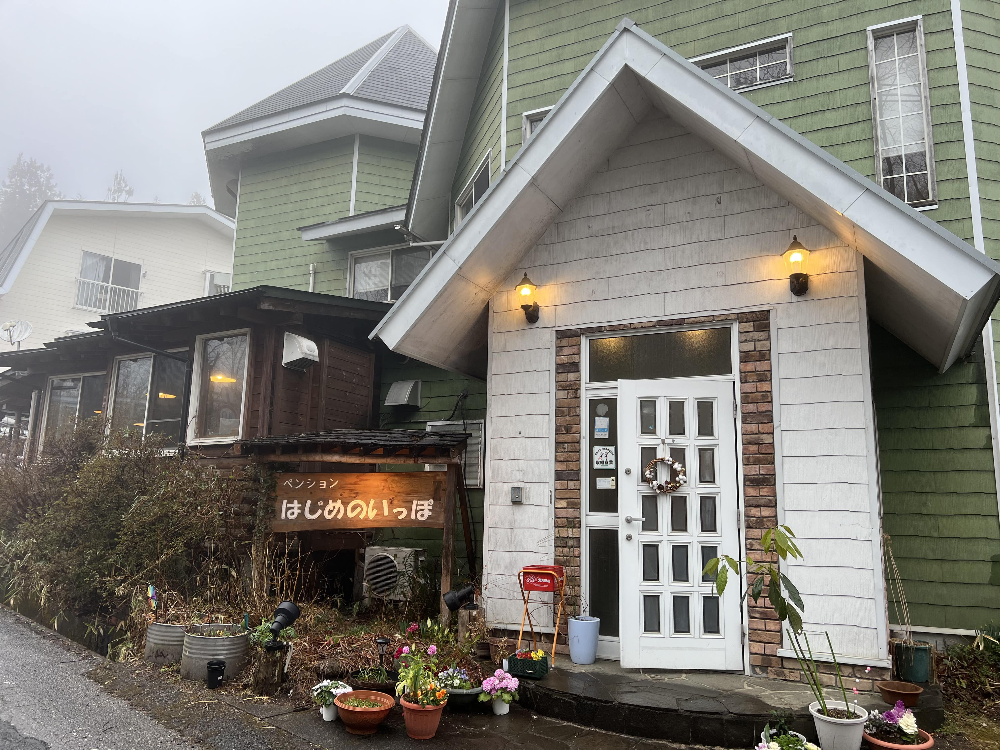
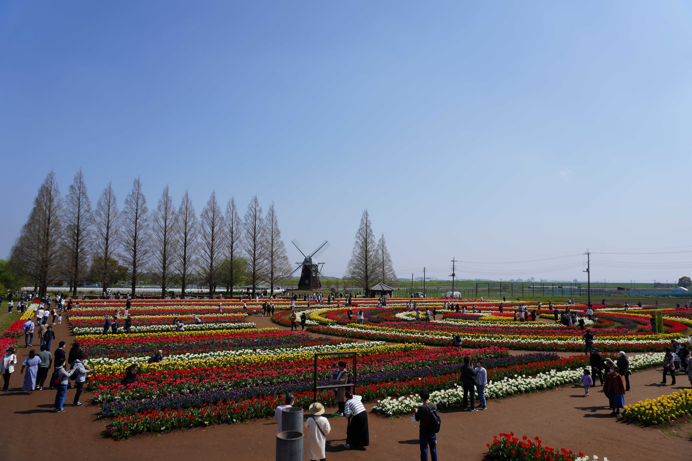

## 今月のトピック

### 月初に体調を崩したことをきっかけに進捗の出ない日々を送った

月の最初にがっつり体調を崩して5日間くらいずっと寝ていた。  
その後体調自体は回復したが、この休みによって続いていた筋トレや色々なものの進捗が止まってしまった。  
継続できていたものが途切れてしまって、そうなるとそこからまた継続させるのに気合が必要になるんだなあということがわかった。

ちなみに筋トレとタスクの進捗はいまだに復活していないので、4月にはまたもとに戻したい。

### 画像編集ソフトを Photoshop から Affinity Photo に移行した

とにかく Adobe が高くてしょうがないので Adobe 製品からの移行を考えていた。  
僕が使っている Adobe 製品は Premiere Pro と Photoshop とたまに After Effect とさらにたまに Audition の4つくらい。

After Effect と Audition は使う頻度がかなり少ないので一旦諦めて捨てて、Photoshop を Affinity Photo に移せないかというのを検討した。

僕がやる画像編集って、写真撮ってどこかに載せる時にレタッチしたりとか、YouTube のサムネを作るときっていう2つでほぼすべてなので、それができれば問題なかった。  
試した結果全く問題なくいけて、そして Affinity Photo は1万円の買い切りなので今月移行することができた。

このおかげでこれまで Adobe はコンプリートプランで月6,000円払っていたが、来月からは Premiere Pro のみになるので月2,000円まで減らすことができた。嬉しい。

Premiere Pro も DaVinci Resolve に移せないか検討して、1度 YouTube の動画をそちらで編集してみたんだけどあんまりうまくいかなくて一旦諦めた。  
これはまたどこかで挑戦したい。DaVinci も買い切りのプロダクトなので、移行出来たら熱い。

### 趣味プロダクト開発で開発合宿をした

少人数のチームで趣味で開発しているアプリがあって、僕はそれのバックエンド API の実装をやっているんだけどそれの開発合宿をした。  
栃木のペンションだったんだけれど安いのにサービスは良いし館内も雰囲気がめっちゃ良いしで素晴らしかった。

趣味プロダクトは進捗が自分のモチベーションに全て左右されるのが大変なところなんだけど開発合宿と銘打って強制的にやらなきゃいけない場になると嫌でも進捗がめっちゃ出るのが良い。

1日しかなかったけれどそれまで空き時間でやっていた1か月分くらいは進んだのですごい。

### ルノー カングー専門店で車を見て車の購入に思いを馳せた

そろそろ僕は車を買おうと考えていて、ずっと EV を調べていて Honda e や IONIQ 5 のどっちかかなあ～って検討していたんだけど、妻と散歩をしていたらふとカングーの専門店を見つけて立ち寄ってみたらめっちゃ良くて購買欲が刺激された。

[ルノー カングー専門店 | RVランド コンセプト アトリエ カングー (a-kangoo.com)](https://www.a-kangoo.com/)

なんせ EV しか考えてなかったから全然こういう車に詳しくはなかったんだけどとにかくビジュアルが良い。  
そしてこのお店はカスタムで塗装してくれるし色んなオプションを付けてくれるのがめっちゃ良くて、特に妻はもうこの車しかないっしょという気持ちになっている。

実際買うとなると考えなきゃいけないことがめっちゃあるので今はまだもろもろ検討段階なんだけど本当に近いうちに車を買うかもしれない…。

### あけぼの山農業公園に行った

娘がずっとお花畑を見たいと言っていたので週末に[あけぼの山農業公園](https://www.akebonoyama-nougyoukouen.jp/)というところにおでかけした。  
まじでただチューリップの花畑があるだけの空間だったんだけどとにかくでかくて広くてきれいで圧巻だった。

こういうただきれいな景色を見に行く、みたいなのを最近やっていなかったんだけど心が洗われるのでどんどんやっていきたい。  
そして娘と行くとピュアな感想しか出てこないのでそれもまた良い影響を受けるため常に子とおでかけしたい。

いつ反抗期で嫌われるかわからんので好かれているうちにめっちゃ色んなとこに行っておこうという気持ちになった。

### BLUE PROTOCOL のネットワークテストに参加した

今月で1番楽しかったイベントはこれ。  
あまりにも最高だった。

これは別記事で詳しく書いた。  
 [BLUE PROTOCOL ネットワークテストに参加した](/2023/04/blue-protocol-network-test/)

## 筋トレ

最初に書いたように、体調不良になって以降、まったく筋トレができなくなってしまった。  
今月の最後の週には1週間に腹筋100回とスクワット50回しかできなかった。

このままではまただめな習慣が始まってしまうので早急に戻していきたい。  
戻していきたいが、ここは落ち着いてまた小さな目標から少しずつ回数を増やしていくのが良さそう。

## 個人開発

上にも書いたように趣味プロダクトの開発合宿に行って、それはとても進捗が出たんだけど逆に言うとそれ以外では一切進捗を出せていないという問題もある。

4月はすでに結構やらなきゃいけないことが決まっていて個人開発の時間をあまり取れなそうな気配があるので来月の振り返りでもここはあまり良いことは書けなそう。  
こういうときは諦めも肝心である。

## YouTube 活動

今月も無事2本の動画を出せた。

- [【モバイルバッテリーの選び方】W(ワット)やmAh(ミリアンペアアワー)って何？これを見ればモバイルバッテリーや充電器の全てがわかります](https://www.youtube.com/watch?v=XDeedsOZagk)
- [【作業効率化】テンキーの最適な置き場所とおすすめテンキーのご紹介【Epomaker FEKER JJK21 Numpad Kit】](https://www.youtube.com/watch?v=oS0yhKa9jeQ)

この2つは、レビュー動画ではなくハウツー動画っていう感じで説明がメインになっている。  
個人的には結構気合を入れて作ったものだったが、結果としては全然伸びなくて、2月に比べるとチャンネル登録者数も全然増えなかった。

こういうハウツー系は長い目で見ると検索に引っかかってゆっくり伸びていく気もするけど、デスクツアーみたいに熱いトピックではないからガッと増えるようなものではないっぽい。

今後の方針として、やっぱり話題になりそうなものを早めにレビューするっていうのはやっていきたいんだけど月2の投稿だとそれも厳しい…。  
4月は月3投稿にするか…？と少し考えたが、別の話で4月は登壇があるので資料作成に時間をとられてしまうので、やるとしてもそれは5月からになりそう。

とりあえず4月の2本はどちらもちゃんとガジェットの紹介をしていきたい。

## 良かったコンテンツ

今月は特にコンテンツを消費できなかった…。良くない…。
