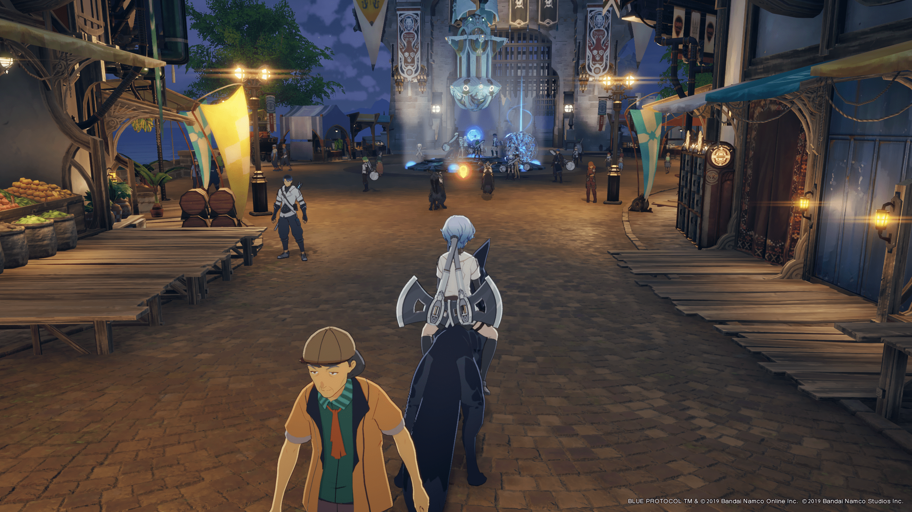

[BLUE PROTOCOL](https://blue-protocol.com/) というまだ未リリースの MMO があって、開発が発表されてからかれこれ8年経っていてずっと開発され続けている。  
僕は確か5年前に YouTube で BLUE PROTOCOL (以下ブルプロ)の動画を見つけて一目見て世界観の素晴らしさに惚れ込んでそれ以来ずっとこのゲームを追っている。  
このゲームは僕にとって希望であり呪いであると言える。なぜならこのゲームを知って以来どんなゲームをやっても結局最終ブルプロがしたいという感想になってしまうようになった。

元々 MMO というジャンルが好きでいろいろと触ってはいたんだけれど、最近はリアル調の洋ゲーばっかりでブルプロのアニメ調 MMO という点は本当にこのジャンルの希望の星だった。  
日本が誇る MMO には FF14、ドラクエ10、NGS などがあって、もちろんどれも文句なしの面白さなんだけど、やっぱり僕の好みという点においてブルプロの完璧に全てがハマる感じはたまらない。

アニメ調で世界観が良い、でかい敵と戦うアクション、素材集めとクラフト、そして MMO。ここらへんが全部僕の好みにぶっささった結果、僕にとって今世紀最大の全ての時間を捧げたいゲームとなった。

そんなブルプロはこれまで3度のテストが行われていて、クローズドアルファテスト、クローズドベータテストは僕は悲しいことに参加できなかった。前回のマッチング負荷テストは参加できたがわりと自由度の低いテストだったので満足度が低かった。  
そして今回、56時間に及ぶ[ネットワークテスト](https://blue-protocol.com/news/44)が行われて無事僕は抽選が当たって参加することができた。

さらに良い話としてはこのネットワークテストの結果が問題なければ、そこからあまり間を置かずに正式リリースをする、ということが運営から伝えられているという点である。

この投稿ではネットワークテストに参加した感想を書きます。

## 感想

何はともあれまずキャラクリをして最初の街であるアステルリーズに降り立ったときの高揚感は本当にすごかった。  
もしこれが VRMMO だったとしてログアウトボタンが消え去って閉じ込められたとしても、この世界であれば全然いけるという気持ちになる。

前回のテストから3年経っているわけで、アステルリーズに降り立った時、またここに戻ってきたんやな…と感慨深かった。  
さしずめ社会人になって3年後、大学時代を過ごした街にふらっと返ってきて通いなれた道を散歩している気分である。

街の中を一生散歩していたかったが限られた時間のテストなので、色々な思いを断ち切ってストーリーを進めた。  
これまで何度も公式の配信や配信者による過去テストの実況プレイを見ているので序盤のストーリーについては把握していたがやっぱり改めてやってみると各キャラクターの魅力がすごくて良かった。  
特に僕はティリスという女の子が推しなんだけど気の強い後輩キャラでとても良い。(残念ながらティリスのスクショは撮り忘れた)

テスト期間中、1日は娘とお出かけをしたのでわりと時間が足りなくて、ストーリーはテスト期間にいける最後のとこまでは終わったもののコンテンツ全てをこなせたわけではなかったのが悔やまれるんだけど、それでも満足できるテストだった。  
やっぱりグラフィックとキャラデザが素晴らしいゲームなのでキャラクリと衣装着せ替えが本当に楽しくて捗った。

もちろんゲームとしてもう少し改善してほしい点はいくつかあった。  
武器や装備に必要な素材を敵がドロップするんだけどドロップ率が渋すぎてしんどいところやおつかいクエストの作業感がもう少し減ってほしいとか。  
とはいえそこらへんの数値的な調整だけですむような部分でしか不満を感じる部分はなかったし、今挙げた問題はすでに運営の中で改善することが決まっているようで、正式リリースにより期待が持てる。

ボス戦がとても面白かったのでスクショを撮っておきたかったんだけど楽しすぎて忘れてしまった。  
ブルプロのテスト終了直前の恒例として、アステルリーズの広場に集まって踊るやつがあるんだけどこれが MMO 感すごくて本当に良い。

惜しむらくはせっかくの MMO なのに誰とも会話をせずたった一人で黙々とソロプレイをこなしていたことである。  
本当のコミュ障はオンライン上でもコミュ障なのである。

こんなことを言っているが MMO の良さというのは別に人と絡まないと感じられないわけではなく、黙々とソロプレイをしていも確かに近くに人がたくさんいて、そして状況に応じて一緒に戦うことができるという、それが良さなのである。  
だから別にひとりでも大丈夫…。

## これから

そんなわけで最高に楽しかったネットワークテストだった。

運営の「ネットワークテストの結果に問題がなければそこから間を置かず正式リリースする」という発言を信じるとして、そしてネットワークテストが問題なかったという前提に立ってこれからを想像してみる。  
(個人的には特に問題のあるバグにぶつかることもなかったしマッチングもめっちゃ快適だったので問題は特になかったんじゃないかと思っている。なかったら良いなあ…)

時期としては5月には GW があるので、そこに合わせてリリースがあると初動のユーザーの伸びに期待できるんじゃないだろうか。  
というか僕が GW を丸々ブルプロにつぎ込みたいのである。  
そういう希望的観測の想像だと4月末にリリースとなってほしい。

とはいえネットワークテストが行われる前に[現在確認されている不具合について](https://blue-protocol.com/news/56)というポストが投稿されており、まあ結構な数が並んでいる。  
正式リリース時にはここに並んでいる不具合は全て解消すると考えられるので、それを残り1ヵ月でやり切ったうえで正式リリースへの準備というのは現実的ではなさそう。  
また、ネットワークテストが終わった後のアンケート・FBをやるのであれば、そこでもいろんな意見が出てきて修正するところはすると考えられるので、そこらへん諸々含めるとまあ～～という気がする。  
ただ今回はネットワークのテストなので、目的は多人数参加した際のネットワークの挙動に問題がないか確認する、というところだと思うので、今回のテストのアンケートとそれによる修正みたいなのはやらないとも考えられる。

みたいな感じで考えてみると初夏リリースあたりが現実的なラインな気がする。  
まあ意味のない想像なんだけどこうやって今後の想像をする時間がとても楽しいのでやめられない。

とりあえず公式から「テストお疲れさまでした&今後について」という公式配信があることを期待しよ。  
おしまい。
