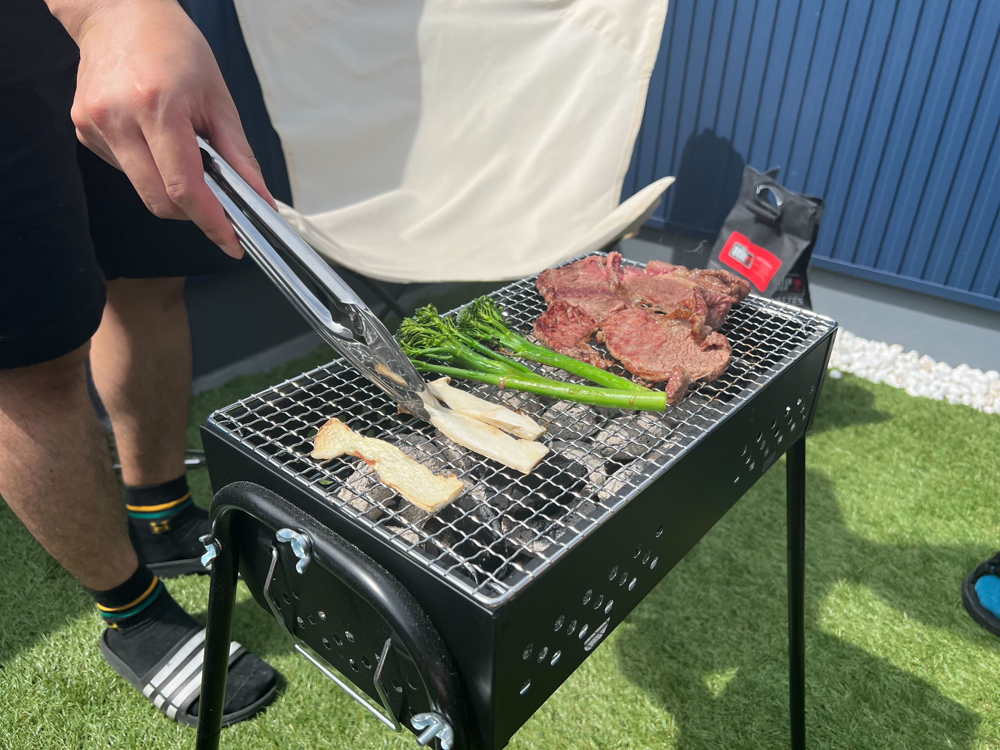

## 今月のトピック

### 家を建てたときに絶対やりたかったベランダ BBQ の実績を解除した

注文住宅で家を建てるとき、絶対にベランダで BBQ したいのでベランダは広く作る、というのを決めていた。  
そして住んでから1年4ヵ月経過して、やっとそれが実現できた。社の同僚を呼んで開催した。

とにかく暑くて死ぬかと思ったけど最高だった。  
今年の夏は家族で毎週くらいのペースでやりたい。ただやっぱ日除けがないのがまじでしんどかったので良い感じの日除けも購入したい。  
そしたら普通に毎日ベランダでキンキンに冷やしたコーラを横に置いて仕事をするとかもありだな。

ベランダ BBQ を実現するために、BBQ の道具を揃えたり、アウトドアグッズを揃えたり、コストコに会員登録するなどをした。  
昔は両親の付き添いでコストコはよく行っていたが、ついに自分が会員となって行くことができた。  
コストコ、めっちゃ楽しい場所なんだけど、一つ一つの商品の量が多すぎて大量なんだけどその分値段も上がるので、コスパが良いのかどうかがぱっと見で全然わからないので雰囲気で買い物をしている。

### ゼルダの伝説 ティアーズ オブ ザ キングダムをやった

詳しくはめちゃくちゃブログに書いた。  
 [『ゼルダの伝説 ティアーズ オブ ザ キングダム』をやった | ナベリヲログ](https://blog.nabeliwo.com/2023/05/zelda-totk/)

今改めてこの記事を自分で読み直すと、めちゃくちゃ語ったけどまだ語り切れてないことがあったということに気づいた。  
誰か僕くらいゼルダシリーズに愛を持っている人と一晩語り合いたいんだけどそもそも友達が非常に少ないのであった。

一つだけここで再度書きたいこととしては、僕の中のゼルダシリーズランキングで1位が更新されるというとんでもない神ゲーだった。  
実はこのゲームが発売される2週間前にブレワイをマスターモードで最初からやり直していて、改めてブレワイの面白さを感じていたところだったんだけどそれを余裕で塗り替えてきた。  
本当に最高のゲーム体験でした。

### BLUE PROTOCOL のリリース日が決まった

全然僕についてのトピックじゃないんだけど、僕がめちゃくちゃ推している [BLUE PROTOCOL](https://blue-protocol.com/) というゲームのリリース日が6/14に決まった。  
4年待った。1つのゲームのリリースを4年間待ち続ける体験なんてめっちゃレアな気がする。その分もう来月に向けてのわくわくが尋常じゃない。

ゼルダ ティアキンの体験を超える最高の感動が味わえることを期待している。

## 筋トレ

5月の前半は先月に引き続き全然週に決めた目標回数を達成することができなかったんだけど、中ごろから復活してきて月末にはもう3月に体調不良になった以前の感じに戻りつつある。  
目標を設定しても全く達成できない週がめちゃくちゃ続いていたので、それを乗り越えるために1回目標を設定するのをやめて、週に何回できるかを計測するだけというのをやってみたところ、そこからまた筋トレの習慣が戻ってきたって感じだった。  
やっぱり毎日いろんな部位を少しずつ筋トレしていると、効果のあるなしは置いておいて肉体的にも精神的にも気持ちが良い。

3年くらい前から健康診断で脂肪肝と判定されるようになって、そこから少しでも生活の中で筋トレを入れようって考えてこういうのをやり始めていたんだけど、多分これだけやってても脂肪肝は直らなくて、ランニングをするか糖分を控えるかっていう僕にとってはどちらも辛い選択肢なんだけどそろそろそのどちらかをとらないといけなさそう。

来月は少しでもランニングをスタートしたいという気持ちだけここに書いておく…。

## 個人開発

特に今月も個人開発は一切やらず。

ただめちゃくちゃ久々に技術記事を書いた。投稿場所としては初めて zenn を使った。  
 [React のレスポンシブ実装おすすめ 2023年版](https://zenn.dev/nabeliwo/articles/89099b39223eca)

あとは個人開発というテーマとは全然関係ないけど収入を増やしたいので副業先を探していて、とりあえず色んな副業マッチングサービスに登録したり、エージェントっぽいところとお話したりとかは月末にやり始めた。

お気持ち的な話としては、もう32歳という年齢になって、そろそろ今のスタンスだと今後のキャリア形成が失敗するというのを自覚するようになった。  
自分はフロントエンドエンジニアであるという気持ちでここまでやってきて、フロントに軸足を置きつつ他の領域もある程度は触る、くらいのスタンスだったんだけど、今後はそういうの取っ払ってサービス開発を一気通貫で高いレベルでやれる人間という姿を目指してやっていく気持ちになっている。  
もちろん、僕よりも年上でフロントエンドエンジニアとしてバリバリやっている人はいっぱいいるんだけど、僕は彼らのようにフロント領域で尖った強みがあるわけではない。あと一生どこかの会社に属して生きるということが気持ち的にできそうにないので、1人で動くことを前提に考えると今回の方針転換が正しいと感じている。

まあ具体的に職種を変えるために今すぐどうということもないんだけど今後の個人的な学習領域に変化が出てくるくらいの感じになる。  
あとこれまではイベント関連は本当にフロントのものしか出ることはなかったけどそういう部分も領域にこだわらずに参加していきたい。

## YouTube 活動

今月は2本の動画を公開した。  
先月1本も動画をあげられなかったので、本当は3本あげて少しずつ4月の空白を取り戻したかったんだけどそれもできず、最低限のラインという感じになった。

- [【ほぼカスタムIEM】Logicool G の完全ワイヤレスイヤホンの機能がすごすぎる！【Logicool G FITS】](https://www.youtube.com/watch?v=KzbNsWX7Ffs)
- [【ながら聴きイヤホン】AVIOT Openpiece M を ambie と比較しつつレビュー【コスパ最高】](https://www.youtube.com/watch?v=yuiVsaRroJc)

特にどちらも伸びてはいない。  
動画を投稿した後、毎回同じガジェットを紹介している他の動画を見ているんだけど、いつもそのクオリティの差に愕然としている。

特に再生回数やチャンネル登録者数にシビアに向き合っているわけではないんだけど、少なくともそのガジェットに興味を持ってたまたま僕の動画を見つけた人に対して有用であること、さらに期待すればこの人良いと思ってもらえること、くらいは目指していて、ただ現状の質だと最低限のラインにも達していないと感じた。

時間がない中で少なくとも月に2本の動画を公開するって考えて、質よりも効率をとってしまった感は自覚しているので、来月はもっと質に向き合いたい。

そういえば直接 YouTube の話じゃないけど、初めて Amazon アソシエイトから報酬をもらった。  
毎回ガジェット紹介したら Amazon のアフィリンクを概要欄に貼ってたんだけど、少しずつ購入されていってついに今月僕の収入になった。  
まあアフィリエイトの収入に期待はまったくしてないんだけど入るとそれはそれでとても嬉しい。今後も特に期待せず概要欄にペタしていこうという気持ちになった。

## 良かったコンテンツ

- [アントマン＆ワスプ クアントマニア](https://marvel.disney.co.jp/movie/antman-wasp-qm)
  - 相変わらずの面白さ
  - マーベル作品の中だとアントマンは特に笑いどころが多くて好き
- [レリック 遺物](https://eiga.com/movie/95190/)
  - 毎月恒例ホラー映画枠
  - ヴィジットみたいな、怖いおばあちゃんが出る映画好きなんだけどこの映画もその意味ではとても良かった
- [パラノマサイト FILE 23 本所七不思議](https://www.jp.square-enix.com/paranormasight/)
  - 感想記事を書くのを忘れていたんだけど、このゲームもめちゃくちゃ面白かった
  - ゲームという媒体を活かしたしかけがめっちゃうまくて、記憶を消してもう1回やりたいシリーズだった
