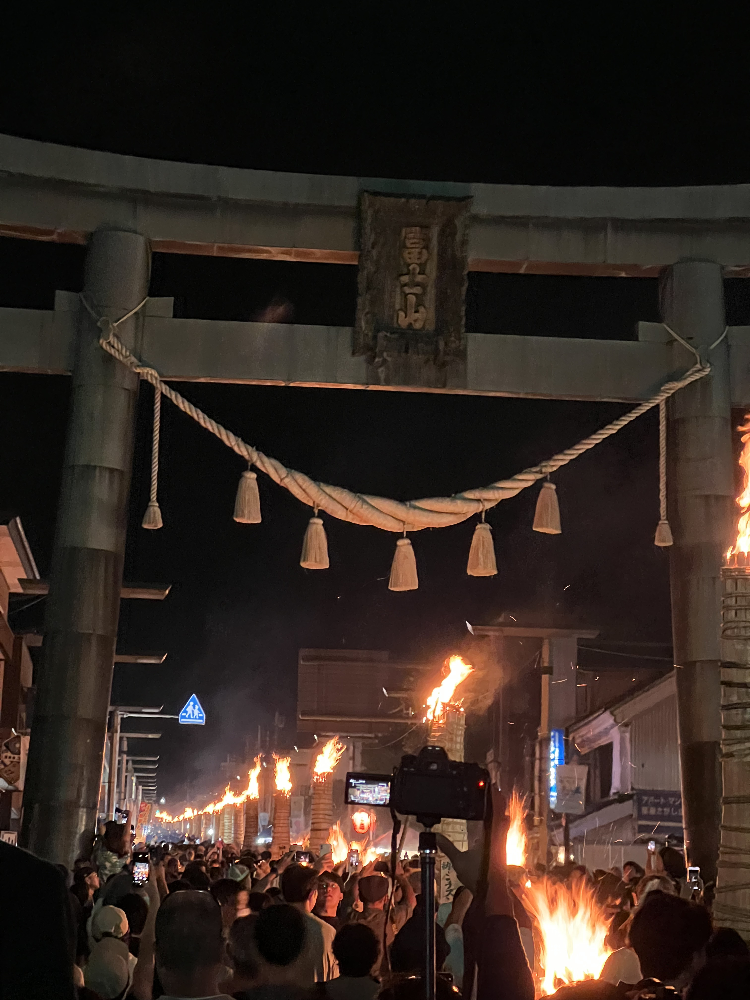

## 今月のトピック

###  お盆に夏休みを取ってめっちゃ遊んだ

今月は11日(金)が山の日で祝日だったのでその前の月曜から木曜の7日から10日も休みを取って9連休を取った。  
実家に帰りつつも結構遊んだのでやったことを書いてく。

**河口湖湖上祭に行った**

家族に地元のお祭りを見せたくて[河口湖湖上祭](https://fujisan.ne.jp/pages/396/)に行った。  
河口湖の周りを囲むように屋台がずらっと並んでいて、最後には湖から花火を打ち上げるやつで、花火がめちゃめちゃ近いのが見どころみたいな感じ。

昔はお祭りに行くと屋台に並びまくっていろいろ食べまくってたしくじ引きとかやりまくってたんだけど今はもうくじ引きはもちろんやらないし、食べ物もチョコバナナを食べてあと主食っぽいものを1つ食べたら満足するようになってしまった。  
なんか雰囲気を味わうみたいな楽しみ方になっていて、これはもう完全に大人になってしまった感。

でもとりあえず娘が楽しんでくれたしめっちゃ近くで見える花火にも興奮してくれていたしで良かった。

**富士急ハイランドに行った**

絶叫マシンが好きすぎるので定期的に遊園地に行ってるんだけど、今回は[富士急ハイランド](https://www.fujiq.jp/)に行った。  
ただ絶叫マシン系は娘がまだ乗れないので、こういうときは実家の両親に預けて妻と2人で行っている。今回もそうした。

こういうとき以外ほんとに常に娘と一緒にいるので、やっぱりこうやって遊ぶときは本当に気が楽で良い。両親に感謝。  
娘は娘でおばあちゃんのことがめっちゃ好きなので1日楽しんでたみたいで良かった。

今回は最近新しくできた [ZOKKON](https://www.fujiq.jp/special/zokkon/) に乗れたのが嬉しかった。他のと比べてめっちゃ怖いというわけではないんだけど新しい感覚の絶叫マシンでめっちゃ楽しかった。  
あとは FUJIYAMA とかええじゃないかとかいつもの最高なやつに乗って満足した。

あとは[絶望要塞](https://www.fujiq.jp/special/zetsubo/)がめっちゃ進化しててデスゲームみたいになってて、内装もめっちゃ良い感じになってて面白すぎて何周もした。  
ゲームの内容も面白いのに加えてとても難しくてやりがいがすごかった。お金があれば絶望要塞だけを回り続ける日を作りたいくらい。

妻と2人で出かけるのも久々だったけどとても楽しかった。

**東京サマーランドに行った**

いつもうちのバルコニーで家庭用のプールで楽しんでたり、保育園の浅いプールで遊んでたりだった娘に、でかいプールの体験をさせてあげたくて連れて行った。本当はその後に海にも連れて行ってあげたかったんだけど、今年はもう時間が取れなくてプールだけで終わってしまった。

東京サマーランドは僕自身学生の頃の思い出がわりとあって、波が出るプールとか流れるプールとか楽しかったのでぜひ娘にも〜という感じ。  
本当はでかいウォータースライダーとかも魅力的なんだけど娘にはまだそれは早いので流れるプールをぷかぷかしていた。

最初は足の付かないプールにめっちゃ怖がってて浮き輪してても全然入れなかったんだけど少しずつ慣れていって、最後はめっちゃ楽しんでくれたので良かった。

**吉田の火祭りに行った**

これも地元のお祭りで、結構珍しいタイプのお祭りで家族に体験してほしかったので連れて行った。[吉田の火祭り](https://fujiyoshida.net/event/154)というやつ。  
残念ながら妻が体調不良だったので娘と2人で行った。

道に並べたたいまつに火をつけてその周りに屋台があって熱い思いをしながら歩き回るお祭りなんだけど、とにかく熱くて楽しいので良い感じ。

娘も熱い熱い言いながらチョコバナナとりんご飴とわたあめを食べて満足していた。  途中で豪雨が降ってきて急いで家に帰ったんだけど、しっかり楽しみ切れたので良かった。

こんな感じで今年の夏は家族で楽しいお出かけを結構できたので良かった。  
めちゃくちゃ俗っぽいことをひたすらしていたので来月はもう少し落ち着いた感じで過ごしたい。

### UI Component 実装について登壇した

[Encraft #6 Focus on UI Component 実装](https://knowledgework.connpass.com/event/291226/) というイベントで、自社で開発している [SmartHR UI](https://github.com/kufu/smarthr-ui) というコンポーネントライブラリの実装についての発表をした。

今年から始まったこの Encraft というイベント自体、とても目立っているイベントで毎回参加者が多く、また主催の方の人柄なのか参加者の雰囲気がすごく良くて発表がしやすかった。

ちなみに僕の発表資料はこちら。  
[Dive into SmartHR UI - Speaker Deck](https://speakerdeck.com/nabeliwo/dive-into-smarthr-ui)

20分の発表枠だったんだけどスライド完成したあと1人でリハしたら40分もかかってしまって、しょうがないので本番では実装の話だけに絞って喋った。  
事後アンケートなどもいただいたんだけど、良い反応をたくさんもらえて、X(Twitter) でもたくさんの方にフォローしてもらえて、本当に登壇者として参加できて良かった。

素晴らしいイベントでした。

### 運動会

年に一度の娘の運動会があった。  
去年からの成長が感じられてめっちゃ感動できた。ダンスを踊ってる娘を見て目がうるうるしてしまった。

娘はリレーとダンス、あとは保護者参加型の大玉転がしという3つの出番があったんだけど、足は速くなってるしダンスは上手だし、玉転がしもとても楽しんでやっていたし、本当に運動会って素晴らしいものだなという気持ちに。

去年に引き続き今年も保護者リレーというクラス対抗でパパママだけで走るリレーがあって、なぜか僕もまた去年に引き続き走る人になってしまって、そしてこれもまた去年と引き続き足を痛めました。

それなりに筋トレとかランニングはしてるんだけどやっぱ全力疾走をできる肉体にはなっていないらしく、2年連続運動会で足を負傷している。  
来年こそは負傷せずに終わりたい。

###  歯医者

虫歯が目立ってきたので歯医者に行った。定期検診とか全然やっていなかったのでもう何年ぶりかわからないレベルだった。  
結果として4本の虫歯があったので、その後通院して今月は2本の虫歯を治療できた。来月また2本治療して、おしまいになる。

虫歯の治療するたびに思うんだけど麻酔してもやっぱめちゃくちゃ怖いしたまに一瞬麻酔を貫通してくることあるし、虫歯治療って本当に生きてる中で一番苦痛な時間な気がしている。  
もうこんな思いはしたくないということで歯磨きのやり方を変えたしデンタルフロスもやるようになった。まだめんどくさくてだるい気持ちが強いので早く慣れて習慣にしたい。

あとこの治療が終わってもしっかり定期検診をしていきたい。

### 課題の山積みと整理

今月の頭、仕事とプライベート含めてやらなきゃいけないことが多すぎて精神がなかなかヤバい状態になっていた。  
目の前のタスクの山がでかすぎて何からやっていいのかもわからなくなって休む時間もなくてああ〜〜〜〜ってなってしまっていた。

あまりにも良くない状態だったので、しっかりと向き合って目の前の課題の山の分解とスケジュール調整とやるやら整理と作業時間確保のための生活改善と、っていうのを整理していって、8月中はそれらを一つ一つしっかりこなしていくというのをやっていた。

結果的に8月の終わりにはそのいくつかは完了したし、まだ残っているものはあるもののタスクの細分化はできたし、一つ一つ向き合ってこなしていけば減っていくことも実感できたしで、精神的にはだいぶ落ち着いてきた。

そして副産物として、今後これは絶対にやらないぞ、みたいなのを明確にできたので、今後の人生においてこういうことをもし頼まれても断るっていう確かな基準を持てたのがとても良かった。

僕の歳くらいになってくると、やらないこと・やめることっていうのをしっかり定義していくのがとても重要だなあと感じる。  
本当にやりたいことに時間を使っていくために、という感じ。

### 現金持たない主義の敗北

富士急ハイランドに行った話を書いたが、そのときに現金がないせいで地獄を見たのでちょっと書く。

僕は現金持たないガチ勢で本当にまじで現金を持っていなくて常に電子マネー、電子マネーが使えないときはクレカ、という生活をしている。  
そんな生活をしていると不便なこともちょいちょいあるので、どこかに行くときはいつもその場所が電子マネーを使えるかどうか確認してから行くようにしている。

富士急ハイランドの駐車場に向かう際、事前に調べて駐車料を電子マネーで払えることを確認したので、意気揚々と車で向かったんだけどいざ駐車場の先払いゲートに着くと普通に現金しか使えなかった。公式サイトの情報だったんだけどめちゃくちゃ嘘だった。

ということでゲートで立ち往生の状態になり、バックしたくとも後ろに車がずらーっと何十台いるのかわからんくらい並んでいて、完全に詰んでしまった。  
一応車降りて後ろの車にバックできないか聞いたんだけど無理ということで、ゲートのところに電話がついていたのでそこから受付に連絡したところ、少々待ってくださいと言われて電話を切られ、その後5分ほど何もできず待ちぼうけになっていた。

後ろに並ぶ車の列もどんどん長くなるし、このときの僕の精神状態はほんとうにやばことになっていて、これほど多くの人に迷惑をかけた経験がなかったので冷や汗を通り越して焦りで失神するんじゃないかって思ってた。  
そのまま何もできずに待っていたら後ろの車のギャルっぽいお姉さんがこっちに来てくれて、事情を説明したところ一旦お金を貸してくれるということになった。  
その場で連絡先を交換して3,000円を借りてようやく駐車場に入れて、富士急ハイランド内の ATM でお金をおろしてお姉さんにお金を返した。

そのときのお姉さんが本当に優しくて素晴らしい人で、絶対イライラしてブチギレてもいい状況なのにあそこまで親切にしてくれて、もう泣きそうになりながら謝罪したり感謝したりしてた。  
あの日以来僕の心の中に仏が生まれて、少し人に優しくできるようになった気がしている。気がしているだけ。

とりあえず教訓として、今のスタイルの生き方はまだまだ厳しい世の中なので、最低でも1万円は常に財布に入れて生きるスタイルになった。屈した。

### PS5

満を持して PS5 を買った。  
情報を色々調べていると、来月に新型の PS5 が出るっぽいので今買うのは悪手かなーって思ってたんだけど、さらに調べてみると来年出るのはディスクドライブが着脱式になったものらしく、性能としては特に変わらないようだったので、パッケージを買わないデジタル一択派の僕としては特に関係ないかな、となり買うことにした。

ただまあ新型が出たら今のやつが値段下がるかもだよな、というのもあったので全然待つべきだとは思うんだけど、FF16 がやりたすぎたのでもう後悔を承知で買ってしまった。

PC ゲーム環境があるのでこれまで PS5 の必要性を特に感じてなかったんだけど、たまに FF16 みたいな PS5 専用タイトルが出てくるのでいつか買いたいなーとずっと思ってんたんだけど、ちょうど会社からの賞与が出たので勢いで買っちゃえーという気持ちになれた。

とりあえず FF16 始めました。

## YouTube 活動進捗

今月は動画を1つもあげられず…。

原因としては上に書いたようにやらなきゃいけないことが山積みになっていたので、今月は YouTube 活動は諦めようという意思決定をしたことによる。  
なので、良くなかった〜みたいな気持ちはないんだけど、今月は0本という事実を考えるとちょっと悲しいのはある。

一応来月はセパレートキーボードを自作するので、そのネタを擦って2本動画を作ろうと思っているので、ネタはあるからあとはやるだけという状態になっている。

良い感じに勢いがついたら3本目の投稿まで頑張りたいな、という気持ちはある。

## 良かったコンテンツ

- [ダークギャザリング](https://jumpsq.shueisha.co.jp/rensai/darkdathering/)
	- ホラー漫画。幽霊を捕まえてその幽霊を使ってまた別の幽霊と戦わせて弱らせてまた捕まえるっていうことをしていくバトル漫画なんだけど、絵が良い感じに気持ち悪いのと幽霊同士のバトルが熱くてハマった
- [戦慄怪奇ファイル コワすぎ!](https://ja.wikipedia.org/wiki/%E6%88%A6%E6%85%84%E6%80%AA%E5%A5%87%E3%83%95%E3%82%A1%E3%82%A4%E3%83%AB_%E3%82%B3%E3%83%AF%E3%81%99%E3%81%8E!)
	- 結構長めのシリーズの映像作品なんだけど、全部見た
	- 全然知らなかったんだけどちょうどよく来月新作が公開されるみたい
	- フェイクドキュメンタリーのホラーなんだけど全てをフィジカルで解決していく勢いがまじで面白くてずっと笑ってみられる。最高だった
-  [エスター ファースト・キル](https://eiga.com/movie/97439/)
	- エスターの1個目結構好きだったんだけど、今作も面白かった
	- 昔のエスターは結構抜けてて失敗が多くてかわいらしいところあるなってなった
- [近畿地方のある場所について](https://kakuyomu.jp/works/16817330652495155185)
	- [カクヨム](https://kakuyomu.jp/) というサイトで連載されていた作品
	- いくつかの事件の記事や、その調査レポートなどが断片的に紹介されていくような形で、少しずつ明らかになる真実がめちゃめちゃ怖くてずっと鳥肌が立ちっぱなしだった
