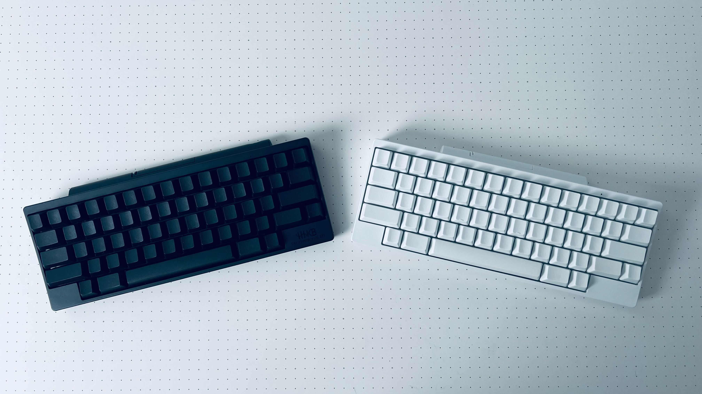
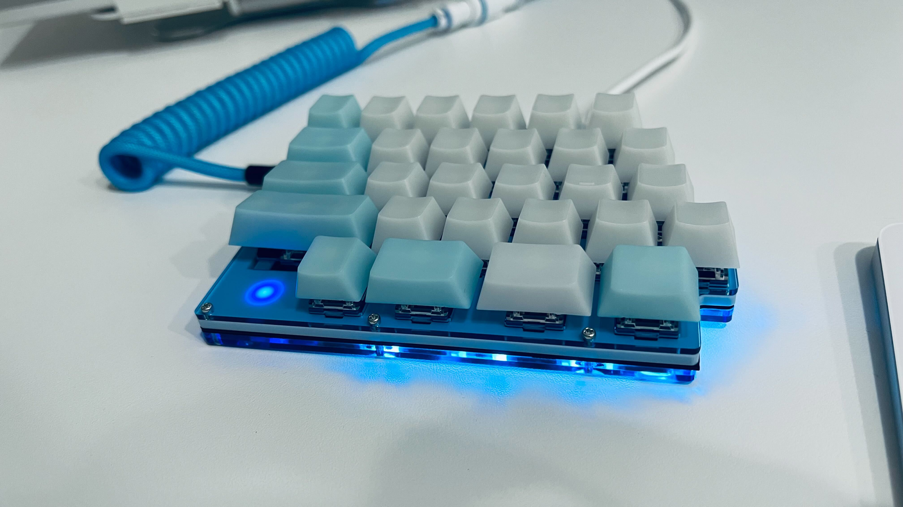
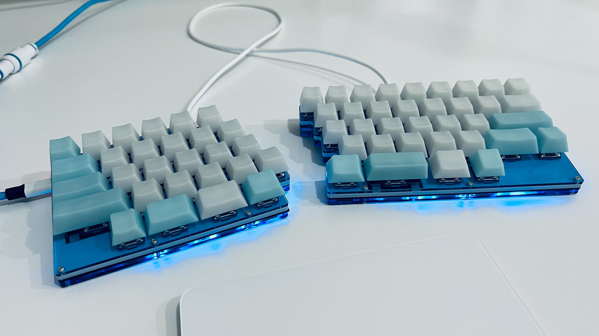
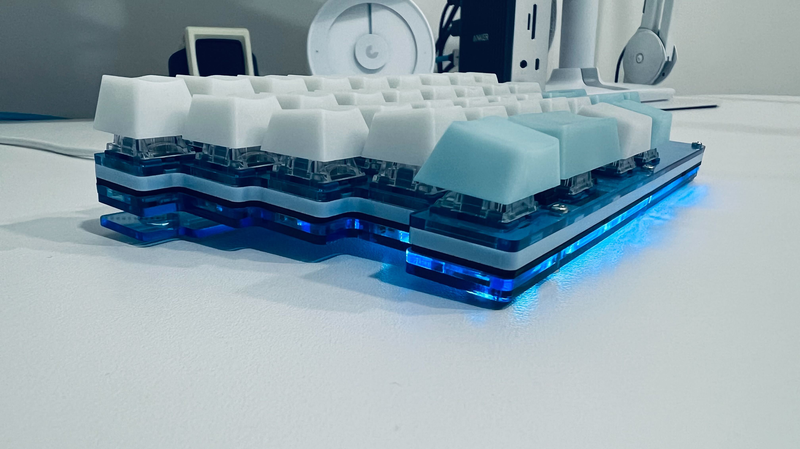

[7sPro](https://shop.yushakobo.jp/products/7spro) という自作キーボードキットを購入して先日組んだので、そのときのメモだったり作ってみた感想だったりそもそも 7sPro の何が良いのかっていう話だったりを書きます。

## 7sPro とは

7sPro は[サリチル酸さん](https://twitter.com/Salicylic_acid3)という方が設計したキーボードで[遊舎工房](https://shop.yushakobo.jp/)で自作キットが委託販売されています。

キーボードの特徴として、[HHKB](https://happyhackingkb.com/jp/) のキー配列を踏襲しつつ分割型にしたものとなっていて、僕みたいに HHKB を2台並べて仮想分割 HHKB をやっているような人に最適なキーボードとなっています。

実際に僕が組んだものと HHKB を並べてみるとわかるのですが、キー配列に関しては HHKB のスペースキーが4つに分割されているくらいの違いしかありません。

7sPro は分割キーボードですが、きれいにくっつけられるようになっていて、その状態だと通常のキーボードのように使えます。

ちょっと一瞬自分語りをしますが、ここで HHKB を HHKB たらしめているものはなんなのかということを考えてみます。  
個人的には2つあると思っていて、静電容量無接点方式によるスコスコする打鍵感、そして独特のキー配列です。この2点が我々が HHKB から離れられない理由なのかなと思っています。実際僕はこれまで他の分割型キーボードに移行したことがあるのですが、結局は HHKB に戻ってしまいました。  
言われそうな意見として、キーマップを変えて HHKB に合わせりゃいいんじゃないのというのがありますが、そもそものキーのレイアウトとして、そうはできないことがほとんどだったりします。  
例えば、一般的な US 配列のレイアウトは enter の上は \ がきてその上に backspace がきます。また、 enter の下には shift がきたり矢印キーがきたりします。そしてそれはキースイッチのサイズとしてもそれこそがベストであるかのような横幅をしています。しかし HHKB の場合は enter の上には delete が着てその上には ~ がきます。そして enter の下には Fn がきます。矢印キーは存在せず、Fn と他のキーの組み合わせて移動を実現します。  
この HHKB の配列をキーマップをいじって再現しようとしても基本的なレイアウトのキーボードだとサイズ感が明らかにおかしい感じになって手になじみません。また、分割キーボードによくあるオーソリニアやカラムスタッガードのレイアウトであればキーマップの変更でいけそうな気配がありますが、そもそもそれはもう HHKB のレイアウトから遠く離れています。なんとなく配置をそれっぽくは置けますが、HHKB の感覚でタイピングをすると誤タイプしまくりです。

つまり 7sPro は HHKB ユーザーになんの違和感も与えず、その上で分割ができる、これを実現している素晴らしいキーボードです。  
スコスコ感の再現はちょっと難しいんですけどお好きなキースイッチが使えるということで…。

## 購入の仕方

なんと遊舎工房さんで[はんだ付け済み簡単キット](https://shop.yushakobo.jp/collections/keyboard/products/3923?variant=42888566210791)が販売されています。  
これを買えばドライバー一本で組み立てができるのでとても楽に 7sPro を手に入れることができます。

ただ今回僕はせっかくの初めての自作キーボードなのではんだ付けしたいなあと思い、自分でやるタイプの方を購入しました。  
ちなみに通販ではなく遊舎工房さんの店舗に行ったのですが、7sPro の組み立ての為に必要なものを事細かに聞いたところめちゃくちゃしっかりと色々教えていただいてとても助かりました。素晴らしいお店。

さらに 7sPro にはフルアクリルバージョンというオプションがあり、基盤を挟むプレートをアクリル素材のもので作ることができます。  
こちらにすると見た目の自由度が広がるので、かわいいもの好きの僕は今回こちらを選びました。アクリルバージョンにするためには自作キット以外でも追加で購入しなきゃいけないものが色々あるのですが、後述するサリチル酸さんの記事で全て細かく解説されているので、特に組み立てる際に何かがなくて困るみたいなことも起こらなかったです。

## 手順

サリチル酸さんがビルドガイドを用意してくれているのでそれを見ながらやれば大体良い感じに進みます。

- [自作キーボードキット『7sPro』ビルドガイド](https://salicylic-acid3.hatenablog.com/entry/7spro-build-guide)
- [自作キーボードキット『7sPro』フルアクリルバージョンビルドガイド](https://salicylic-acid3.hatenablog.com/entry/7spro-acrylic-build-guide)

また、キーボードレビュー動画を投稿されている [Daihuku さんの動画](https://www.youtube.com/watch?v=0SnyE86LGKM)では組み立ての様子を映像で細かく紹介してくれているので、それもとても参考になります。  
あとはトラブルが起きたらひたすらググって他の人のブログなどで補填して組み立てました。

ちなみに 7sPro は最初からある程度はんだ付けされていて、自分ではんだ付けしないといけない箇所は最小限になっており、僕の記憶だと60回くらいはんだをプシューしたら終わったので、自作キーボードの中ではわりと難易度が低い方だと思います。  
僕は最後にはんだ付けをしたのが約3年前とかだったのですが、無事に完成させられました。

一応購入した部品を載せておきます。

- [7sPro 自作キット](https://shop.yushakobo.jp/products/7spro)
- [キーボードアクリルプレート](https://shop.yushakobo.jp/products/keyboard_acrylic_plate/)
  - 7sPro 2mm と 7sPro 3mm
- [オプションパーツ](https://salicylic-acid3.booth.pm/items/1969787)
  - フルアクリル用ネジセット

あとはドライバーやはんだごての他に、やすりやグリスも用意しました。

## 困ったこと

組み立てていく中で困ったこととどう解決したかというのも載せておきます。  
大した情報ではありませんが、もしかしたら誰かの参考になるかもということで。

### QMK Toolbox でファームウェアを書き込めない

QMK Toolbox で Pro Micro にファームウェアを書き込もうとすると `avrdude.exe: ser_open(): can't open device アクセスが拒否されました` と表示されてしまい、書き込みが失敗してしまいました。  
途方に暮れていたのですが、しばらく調べてみると NZXT CAM のようなモニタリングアプリが動いているとこれが起きるというのを見て、ちょうど NZXT CAM を使っていたのでそれを落として再度実行してみると無事に成功しました。

### ファームウェアの書き込みに成功しても LED が光らない

キースイッチを押すとしっかり反映はされるのですが、LED が光りませんでした。  
原因の切り分けの仕方さえわからなかったので、とりあえず一度 LED テープにつけたはんだをはんだ吸引機で外して、再度はんだ付けをしたら無事に LED がつくようになりました。  
単純にはんだ付けに失敗していたらしい。

### TRRS ジャックがもげた

完成した後の話ですが、TRRS ケーブルを挿したり抜いたりを繰り返していたところ、TRRS ケーブルがもげてしまいました。  
これも特に根本原因の解消はできていないのですが、はんだ付けをやり直して元に戻しました。調べてみると TRRS ジャックはもげやすいようなので、しっかりとはんだ付けをしたらあとは優しく扱うという運用でカバー方式でやっていく気持ちになりました。  
また Pro Micro の Micro-USB ももげやすいようなので、こちらはマグネットでつけるタイプのケーブルを使うなどした方が良いかなと思いました。

## そして完成

少しトラブルもありつつもなんとか詰むことはなく完成させられました。

アクリルプレートは、3mm のプレートをパステルの水色に、2mm のプレートを透明の青にしました。  
結果的にとても綺麗に色になったので満足しています。

Fn を押してレイヤーを切り替えると LED が点灯するのもかわいい。

### キースイッチ

今回は3種類のキースイッチを試しました。

- [TTC Speed Silver](https://www.fumo-shop.com/ducky-keyswitch-ttc-quicksilver.html)
  - 僕の一番のお気に入りのキースイッチ
  - 銀軸は作動点が短いのでゲーム向きなのですが、普通にプログラミング用途でも僕は好きです
  - なによりキースイッチの色が青と白なのがかわいくて好きです
- [Kailh Super Speed Switch Silver](https://shop.yushakobo.jp/products/4280?_pos=4&_sid=a25afcf23&_ss=r)
  - これも銀軸なので TTC とあまり変わらないのですが、TTC より少し押下圧が軽い
  - 別の銀軸も試してみたくて買いました
- [Durock Black Lotus](https://shop.yushakobo.jp/products/6337)
  - 最近よく聞くめっちゃ良いと噂のキースイッチ
  - 実際試してみて、少し重いんだけど抜群に打鍵感や打鍵音が良かった
  - が、悲しいことに 7sPro につけるとキースイッチがチラ見えするときに紫の主張が強すぎて僕の好みではなかったので断念
  - キースイッチが見えないタイプのキーボードに使いたい

結果として、今回もまたいつも使っている TTC Speed Silver を使いました。

### キーキャップ

今回は [EscapeKeyboard の POM Jelly Keycaps](https://www.fumo-shop.com/catalogsearch/result/?cat=2&q=EscapeKeyboard+POM+JeLLY+Keycaps&order=relevance&dir=desc) を使いました。  
色んな色があるんですが、メインのキーは白に、機能キーは青にしました。

ただ実際につけてみると、写真を見るとわかると思いますが結構くすんだ色に見えてしまってちょっと僕の好みとは違いました。  
キースイッチ部分が光るキーボードとかだと良い感じに光を透過してきれいに見えるキーキャップなんだろうなあと思いますが、今回はちょっと満足できなかったのでのちのち変えると思います。  
もっと明るいパキッとした色にしたい。

## 感想

アクリルプレートの組み合わせを頭の中だけでシミュレーションして購入したんだけど実際作ってみると思ってた通りめっちゃ好みの色合いになって、それがとにかく嬉しかったです。

そしてなにより初めての自作キーボードがしっかり完成までいけて無事に動くようになったのがとても嬉しい。  
このブログは 7sPro で書いているのですが、HHKB 2台体制とほぼ変わらない体験でタイピングできるので、慣れるまで時間がかかるという弊害もなく使えているので、総じて満足感が高いです。

あとは気になっているところとして、先に書いたキーキャップを変えたいという話の他に、さすがに Micro-USB はちょっときついので Type-C に変えたいというのがあります。  
Pro Micro に Type-C のものがあるようなのでそれに変えるか、key micro というのもあるらしいのでそれに変えてもいいのかもしれない。できるのかどうか何もわからずに言っています。

あとは現状 USB ケーブルと TRRS ケーブルをありもので対応しているので、それも 7sPro に合ったかわいいやつに変えてあげたい。  
わりと見た目をこだわることでテンションが上がって仕事へのやる気に繋がっていくタイプなのでそこはしっかりやっていきたい。

そして作っている最中の様子を動画に撮っていたのでこれはそのうち編集して YouTube にあげたいと思ってます。

最後に、こんなに素晴らしいキーボードを設計してくれて、かつわかりやすいビルドガイドも残してくれているサリチル酸さんに感謝です。
