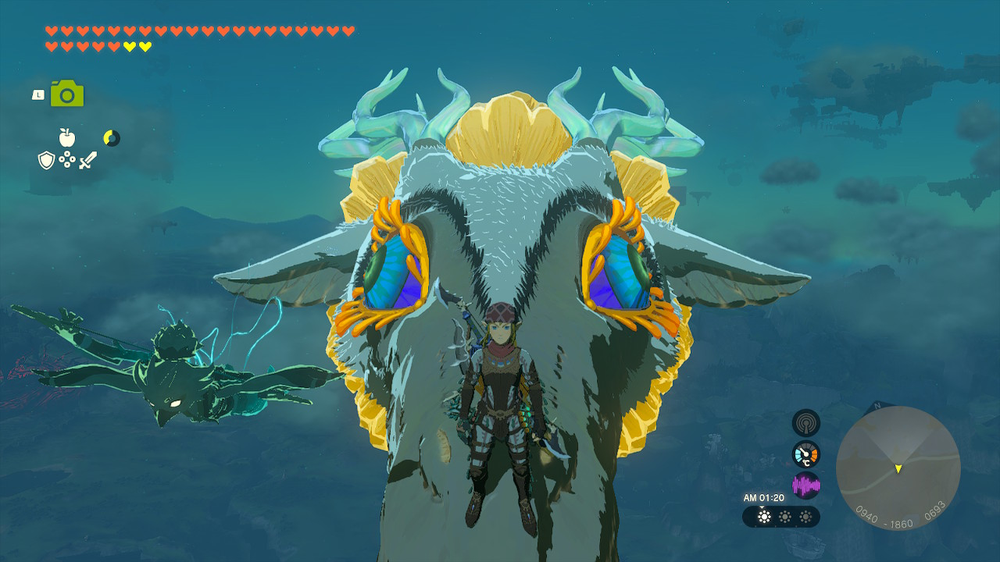
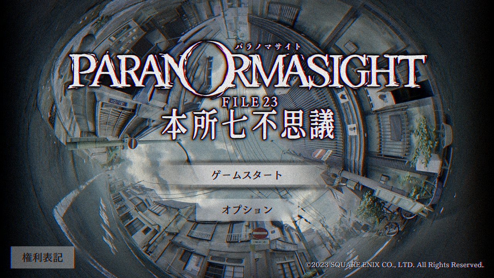

2023年にやったゲームの中で良かったものを紹介します。  
良かった順に8個選んで書いているので、一番上が僕の2023年の GOTY です。

## ゼルダの伝説 ティアーズ オブ ザ キングダム

もう本当に最高でした。今年一番というかもはや近年稀に見る神ゲーだった。  
あまりに感動したのでそのときの気持ちをしたためています。  
[『ゼルダの伝説 ティアーズ オブ ザ キングダム』をやった](https://blog.nabeliwo.com/2023/05/zelda-totk/)

上記の記事で全てを語っているのでここで書くことも特にない。  
これに関しては多くの人にとっても文句なしの今年一番だったと思う。

公式サイトはこちら。  
[ゼルダの伝説 ティアーズ オブ ザ キングダム](https://www.nintendo.co.jp/zelda/totk/index.html)

## パラノマサイト FILE 23 本所七不思議

2023年は各社からAAA級タイトルがいっぱい出ていて凄まじい当たり年だったわけだけれど、そんな中でこのパラノマサイトはアイディアで完全勝利している素晴らしいゲームだった。

SNS でこのゲームが面白いらしいというのを見て、ほんまかあ〜〜？と思いながら始めたところ、さあ今から呪い合いバトルが始まるぞってなったところでめちゃくちゃ興奮した。買って良かった〜〜ってなった。  
ゲーム内にたくさん仕掛けられているトリックがとても良くて、うは〜なるほど〜〜〜って100回くらいなった気がする。

あとキャラデザがめちゃ良い。僕の推しは志岐間春恵さん。結婚したい。

公式サイトはこちら。  
[パラノマサイト FILE 23 本所七不思議](https://www.jp.square-enix.com/paranormasight/)

## BLUE PROTOCOL

僕が5年くらいリリースを待ちわびていたゲーム。  
待ちわびていたはずでリリースされたらもうこれ以外のゲームができないんじゃないかくらいの気持ちだったんだけど、蓋を開けてみたら結構残念ポイントが多くて結局そこまでめちゃくちゃやったわけではない。

とはいえ面白いのは間違いなくて、この世界観と素晴らしい画作りの中で好みのキャラデザでキャラクリができて MMO ができるっていう体験が本当に良い。  
(制作側は MMO とは言ってないんだけど個人的には MMO だと思ってる)

まだストーリーは4章までしかなくて全然話が着地する気配は見えないんだけど普通に面白いし今後にも期待できる。  
というわけで来年もちょこちょこプレイしていくであろうゲームです。

残念なのは僕に友達が少なくて一緒にやる相手がいないことです。

公式サイトはこちら。  
[BLUE PROTOCOL](https://blue-protocol.com/)

## ホグワーツ・レガシー

(ここからはスクショはなしでいきます)

これも発売前から約束されし神ゲーだったんだけど、実際やってみたら本当にハリーポッターの世界観が忠実に再現されていて、歩いてるだけで最高なゲームだった。  

僕はハリーポッターの大ファンなので歩いてるだけで楽しい感じだったんだけど、魔法バトルは面白いしストーリーも良かったしファンじゃなくても楽しめる良いゲームだったと思う。

惜しむらくは僕の PC がもうパワーが足りなくて画質設定を下げざるを得なかったこと…。  
グラボ買い替えたい…。

公式サイトはこちら。  
[ホグワーツ・レガシー](https://www.hogwartslegacy.com/ja-jp)

## FINAL FANTASY XVI

僕は FF シリーズはそこまでめっちゃ好きというわけではないんだけど、16はプロデューサーが吉田直樹さんだったので絶対やるぞ！と思っていた。(FF14は好きなので)

通常の戦闘がすでにめっちゃ楽しいんだけど、召喚獣バトルになった途端凄まじいエンタメで遊園地で遊んでるみたいな体験になるゲーム。  
FF15 のときも同じような感想を持ったんだけどそれよりも数段レベルアップしてる感じがあった。

ただストーリーが重くて消費カロリーが高くて僕は長時間続けられる感じではなかったので少しずつプレイして完走した感じ。

トルガルとアンブロシアがめっちゃかわいくて僕もペット飼ったらこの2人の名前にしようという気持ちになった。

公式サイトはこちら。  
[FINAL FANTASY XVI](https://jp.finalfantasyxvi.com/)

## 超探偵事件簿 レインコード

ダンガンロンパシリーズが本当に大好きなので、ダンガンロンパの制作陣が作ったこのゲームにはとても期待していた。  
結果的には期待値が高すぎた感じなんだけど、相変わらずストーリーはぶっ飛んでいてフラットな目で見たらめちゃくちゃ面白かったと思う。

スキームは完全にダンガンロンパと同じで、ストーリーが進むと事件が起こって調査パートが始まって推理パートが始まって1つの章が終わりっていう感じ。  
ダンガンロンパシリーズはそのトリックの面白さと全体的なストーリーのぶっ飛び具合がすごくてめちゃくちゃおもしろかったんだけど、その感じはしっかり引き継いでいてよかった。  
特に最初の電車の中の事件のトリックはすごかった。ああこの感じこの感じ〜〜〜〜！って気持ちになれた。

個人的にはもっと人気が出てほしかったんだけど、ダンガンロンパシリーズのときからあった推理パートの謎のよくわからんアクションとか、死神ちゃんの押し出しがすごすぎるのとか、欠点も多いなとは思ったのでそこは残念だった。

公式サイトはこちら。  
[超探偵事件簿 レインコード](https://www.spike-chunsoft.co.jp/raincode/)

## ピクミン４

過去作に出ていたピクミンが全員集合しているのが素晴らしかった。  
まったり落ち着いた気持ちでできて癒やされていたんだけど、最後のやりこみ要素はめっちゃ考えてやらないと全然クリアできなくて良いバランスだった。

特に何が新しいってこともなかったんだけどピクミンはもうピクミンなので普通にとても面白かった。

公式サイトはこちら。  
[ピクミン４](https://www.nintendo.co.jp/switch/ampya/index.html)

## ドラゴンクエストモンスターズ３ 魔族の王子とエルフの旅

ドラクエモンスターズは、配合というゲームシステムが神がかっているのでその時点で間違いないと思う。

ストーリーが正直結構う〜〜んというところがあったり、ベネットというキャラがあんまり好きになれなかったり、ベネットは好きじゃないのにベネットの声優は僕が大好きな松岡さんでモヤっとしたり、残念な点が結構あったんだけどそれを差し引いてもゲームシステムが素晴らしいので面白い。

Xランクのモンスターがめっちゃ少ないのは結構不満に思っていて、もっとモンスターの数を増やしてくれたらいいのになあという感じ。

公式サイトはこちら。  
[ドラゴンクエストモンスターズ３　魔族の王子とエルフの旅](https://www.dragonquest.jp/monsters3/)

## 感想

今年は素晴らしいゲームが多かったですね。

僕がスプラトゥーンにはまった2016年から2022年まで、僕のゲームライフは完全にスプラトゥーンに支配されてスプラトゥーン以外のゲームをあまりできなくなってしまっていた。  
そんな状況を乗り越えるために今年は完全にスプラトゥーンを引退したんだけど、おかげで日々の暮らしに余裕を取り戻すことができたし色んなゲームができたので良かった。

ただ今年は本当はもっとやりたいゲームがいっぱいあったんだけど、時間が足りなくてできないものが多かったのでそれらはまた来年やっていこうと思います。  
(Starfield と AC6 ができなかったのが無念)

## 2023年発売じゃないけど今年やってよかったゲーム

余談ですが、今年発売じゃないんだけど今年やって良かったものも軽く書いておく。

- [アンリアルライフ](https://www.unreal-life.net/)
  - ドット絵で作られる世界観が美しすぎて良かった
- [星のカービィ ディスカバリー](https://www.nintendo.co.jp/switch/arzga/index.html)
  - 妻と2人でやってめっちゃ良かった
  - 妻と仲良しになれた
- [CRISIS CORE -FINAL FANTASY VII- REUNION](https://www.jp.square-enix.com/ccffvii_reunion/)
  - ザックスがあまりにも良すぎて大好きになっちゃった
  - FF7 REBIRTH では展開が変わってザックスががっつり出てくるっぽいので楽しみ
