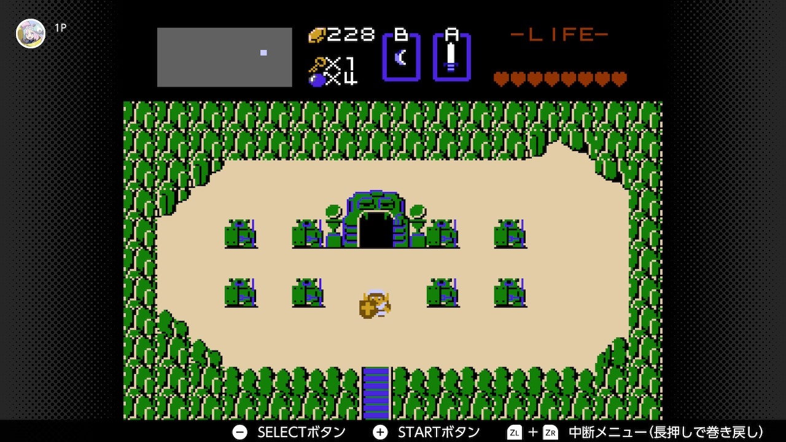
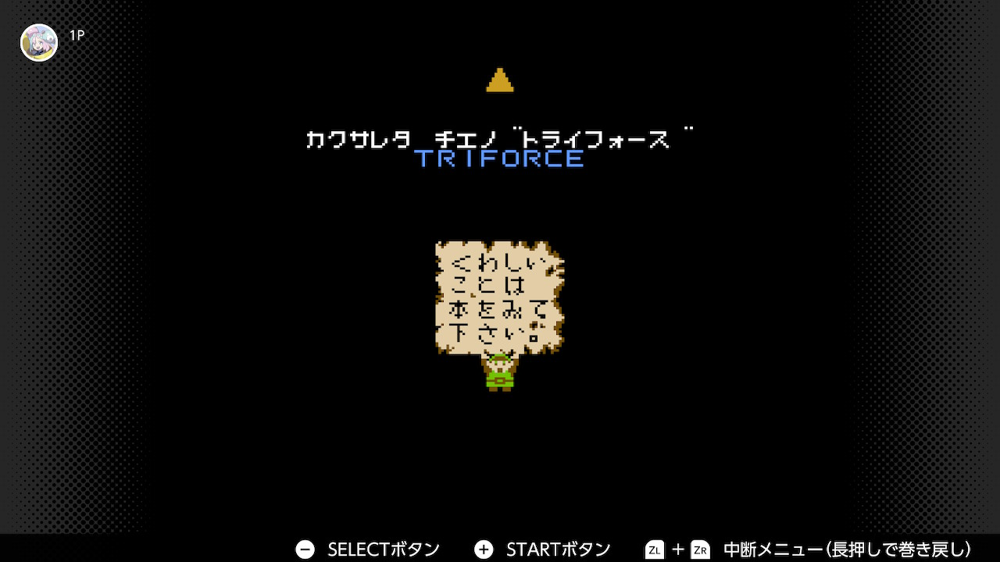
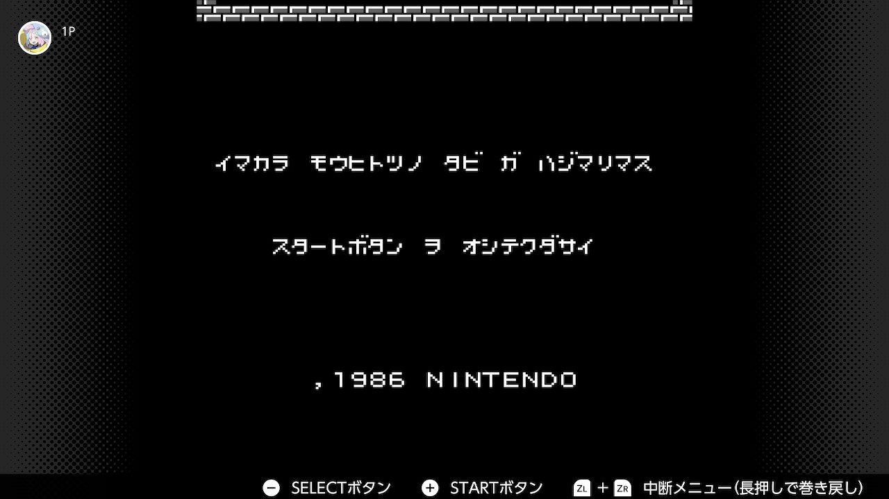

僕の中でゼルダの伝説全部やり直すぞタイムに入っているのでその第一弾として初代[ゼルダの伝説](https://www.nintendo.co.jp/software/zelda1/index.html)をやった。  
ていうかすごい昔のゲームなのに公式ウェブサイトちゃんと作っててすごい。(Nintendo Switch Online にゼルダを追加したタイミングで作ったのかも)

## 雑な感想

ゲームが始まると突然フィールドで動かせるようになる。  
このゲームの前提のストーリーとかは説明書に書いてあって、操作の仕方とかもそっちを見て覚えてからプレイすることを前提になっている。まあ昔のゲームはみんなそうで、容量の削減のために説明書で解決できることは全部そっちでやってるんだと思う。  
そう考えると今のゲームは本当に優しくできていてすごい。

基本的にフィールドを散策して色んなアイテムを集めて、そのアイテムで行けるところを増やしつつ、フィールドのどこかにあるダンジョンを9個攻略したら全クリになる。  
プレイしてて思ったのは、爆弾で破壊して入れる洞穴とか、木を燃やすことで出現する階段とか、そういう場所がいくつかあるんだけど全部ほぼノーヒントなのでそこらへんは鬼畜仕様だなと思う。

フィールドやダンジョン内で出会うザコ敵がやっかいで、基本集団で現れて遠距離攻撃を放ってくる敵が多いので、こいつらに体力を削られる。  
そしてこれらの敵と戦うことでゼルダの伝説というゲームでの動き方を手になじませてダンジョンのボスに挑むわけなんだけど、ボスはめっちゃ弱い。  
ザコ敵のやっかいさに比べてボスはとても戦いやすく、また体力も少ないのであっさり倒すことができる。  
ただここらへんは最近のゼルダシリーズを思い浮かべてみても基本ボスは弱いので最初からゲーム性は一貫していると言えるのかもしれない。

プレイ時間は大体5時間くらいで、ただこれは僕がすでに昔一回やったことあることや後述する Nintendo Switch Online の機能のチートを使っているからなので、そういうのなしでやったら多分10時間とか、下手したら20時間くらいかかるかもしれない。

Nintendo Switch Online には巻き戻し機能というのがあって、R2 と L2 を同時長押しすることでいつでもどこにでもゲームを巻き戻すことができる。これはアクションゲームにめちゃくちゃ相性が良くてダメージを食らうそばからその直前に戻ってやり直せる。そうなるとダンジョンの攻略難易度がめちゃくちゃ下がる。  
基本は使わないようにしてたけどあまりにめんどくさいダンジョンとかは使って時間の節約をしてしまった。

あとはお金を増やせる洞穴というのがあって、3つの選択肢があってそのうち1つはお金が増えるんだけど残り2つは減るっていうギャンブル要素がある。  
これが洞穴に入った時点でどこが正解かが確定するので、適当に1つ選んで失敗だったら選ぶ前に戻して正解の選択肢を選べばいいことになる。  
ゼルダの伝説は結構お金を使うゲームになっていて、ザコ敵をひたすら倒してお金を貯めるのが一番めんどくさいところなんだけど、このやり方で一瞬で最大の255ルピーを貯めることができるので金策に使う時間をなくすことができちゃう。  
こういうただめんどくさい部分を削れるのは本当に良い。

## クリア後

このゲームは一度全クリをすると、次は裏ゼルダと呼ばれる難易度アップ版が始まる。  
ダンジョンの構成が変わってたり新しい敵や罠が追加されたりしているモードで、特にストーリーに違いはないのでもっと高い難易度を求める人は裏ゼルダをやったらいいと思う。

クリア後にちゃんとこのゲームのストーリーを公式サイトなどで見たんだけど、自分が集めいていたトライフォースは知恵のトライフォースだったのかとか、勇気のトライフォースはこのゲーム内には存在しないのかとか、今更ながらの新しい発見があったので、プレイする際は事前に前提となるストーリーを把握しておくことをおすすめしたい。

## おわり

次は[リンクの冒険](https://www.nintendo.co.jp/software/zelda2/index.html)やるぞ！
