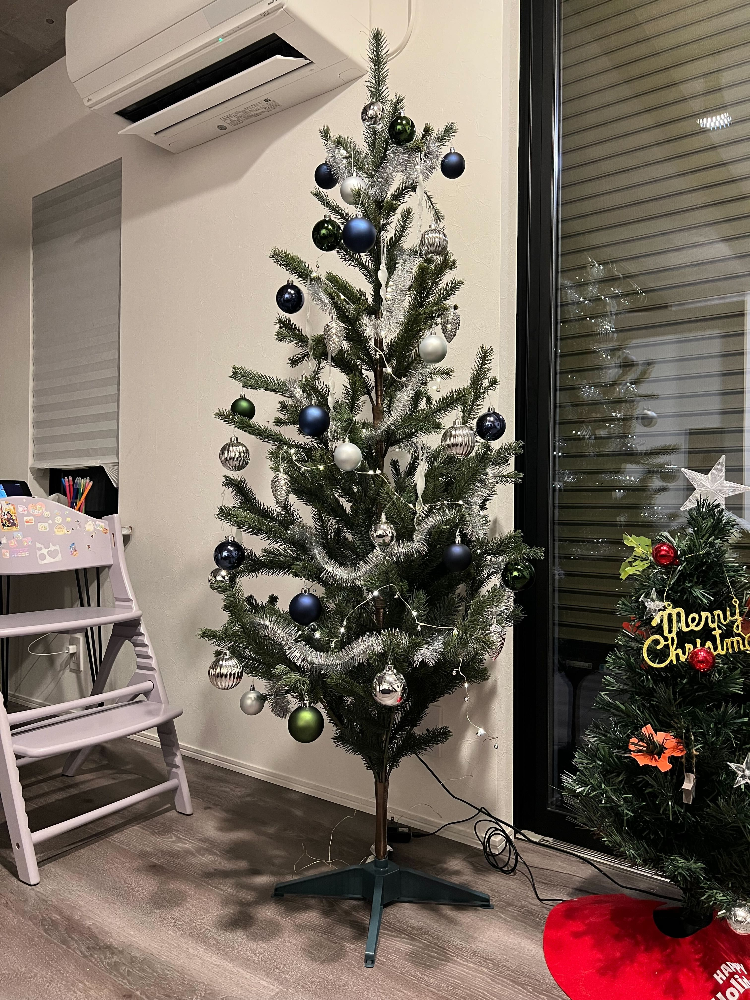

## 今月のトピック

### インフルエンザからの復活でスタート

11月末にインフルエンザになって今月の頭に復活したんだけど、病み上がりで運動の習慣が途絶えてしまって月初あたりはルーティンをこなせなくてしんどかった。  
中旬くらいから運動習慣が戻ってきたので気持ちよく生活できるようになってきた。

毎度のことだけど体調を崩すと直った後もしばらく生活がもとに戻らなくて崩壊するのが良くない。  
というか今年は体調を崩しがちでこういう残念な気持ちになることが多かった。  
いくつか要因が思い当たる体調不良があったので、まずはそこらへんを二度と同じことが起きないように改善していきたい。

### クリスマス

クリスマスのちょっと前から、娘に「サンタさんにお願いしたいものがあったらお手紙書くんだよ」と伝えていたんだけどそれが週に1個ぐらい増えていって最終的に4つサンタさんにおねだりしていた。

頑張って全部買ったんだけどやっぱ25日の朝にテンション爆上がりして喜ぶ娘を見るととても嬉しい気持ちになるので、クリスマスはあげる側になっても良いイベントだなと思う。

あとは普通にちょっと豪華なご飯を食べてケーキを食べて楽しく1日を終えられた。

### 忘年会

今年は参加した忘年会は2回だった。  
飲み会出席率がめちゃくちゃ低い僕としては2回というのはとてもすごいことなのです。

友達との忘年会と会社メンバーとの忘年会。

友達との忘年会は、家の話と子どもの話がほとんどで年を取ったことを露骨に感じる。  
エンジニア友達なので価値観が結構近くて人生のフェーズもわりと似通っているのでわかり合いながら会話が進むので個人的にはとても好きな集まり。  
ここに体調の話まで加わってくると本当にやばそうなので普段から運動と食事管理をして健康を害することがないように生きていきたいという気持ちになった。

会社メンバーとの忘年会も良かった。  
弊社の人は本当に気持ちの良い人が多くて、忘年会で仕事の話が出ても前向きにモチベーションが上がる感じで話が完結するので、僕がよく感じる飲み会の帰りの電車でつらい気持ちになるやつが起こらなくて良い。  
この一緒に働くみんなの役にも立ちたいし来年のお仕事がんばるぞいという気持ちになれたので良い会だった。

## 個人開発進捗

特に個人開発は今月もまったくせず。
ただ技術的なインプットは結構あって、今月は iframe とか 3rd Party Cookie とか Storage Access API にめちゃくちゃ時間を使っている。

まあそれが今後の個人開発に繋がることは特になさそうなんだけれど。

## YouTube 活動進捗

YouTube の動画投稿は今月もまたできなかった。  
11月も動画をあげなかったので2ヶ月連続サボりになってしまった。

12月って動画投稿者的には1年の振り返り的な、2023年買って良かったものとかそういうのが伸びるので動画を出すべきなんだけれど、ちょっと YouTube モチベーションが下がってしまっており何もしなかった。

来月は [GrabShell](https://grabshell.site/) の動画出すしそこからまた仕切り直していくぞ。

## 良かったコンテンツ

- [ドラゴンクエストモンスターズ３ 魔族の王子とエルフの旅](https://www.dragonquest.jp/monsters3/) やった
  - 配合というゲームシステムが相変わらずめっちゃ面白くて素晴らしい
  - ゲームシステムの素晴らしさに助けられてるんだけどストーリーとかは結構不満があるのでそこはちょっと残念だった
- [8番出口](https://store.steampowered.com/app/2653790/_/?l=japanese) やった
  - 流行ってるやつ
  - めっちゃ面白かったんだけどめっちゃ酔った
- [陰の実力者になりたくて！](https://www.shadow-garden-mog.jp/) のラノベの方全部読んだ
  - アニメが面白かったのでラノベの方を既刊全部読んだ
  - 勘違い系コメディみたいなジャンルが僕はめっちゃ好きなんだなと思った
  - あとは登場キャラが多くてそしてみんなとてもかわいくて良い
  - ちょうどアニメ2期も終わって続きは劇場版でやることが決まってとても熱い
- [変な家２ 〜11の間取り図〜](https://www.asukashinsha.co.jp/bookinfo/9784864109826.php) 読んだ
  - 雨穴の最新作
  - 面白かったけど後半の解決編が淡々とあっさり進んでくのであんまり読み応えがない感があって、個人的には雨穴の他の作品のほうが良かった
- [3rd Party Cookie Advent Calendar](https://qiita.com/advent-calendar/2023/3rd-party-cookie) 読んだ
  - アドベントカレンダーなんだけど28日目まで続いた稀有なやつ
  - 1記事が短くて読みやすくてそして 3rd Party Cookie の現状がよく分かるめっちゃ良い連載だった

---

来月から2024年だしこのふりかえりブログのフォーマットもちょっと変えようかなと思ってる。
