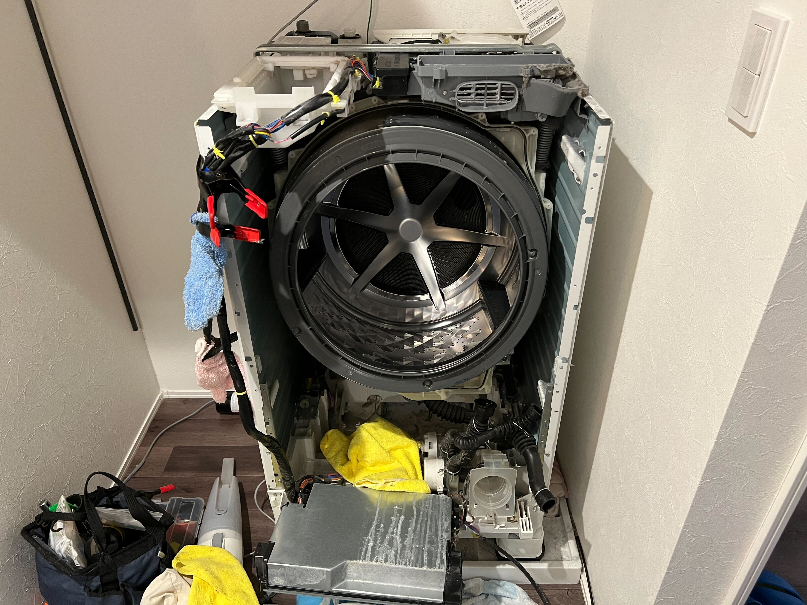
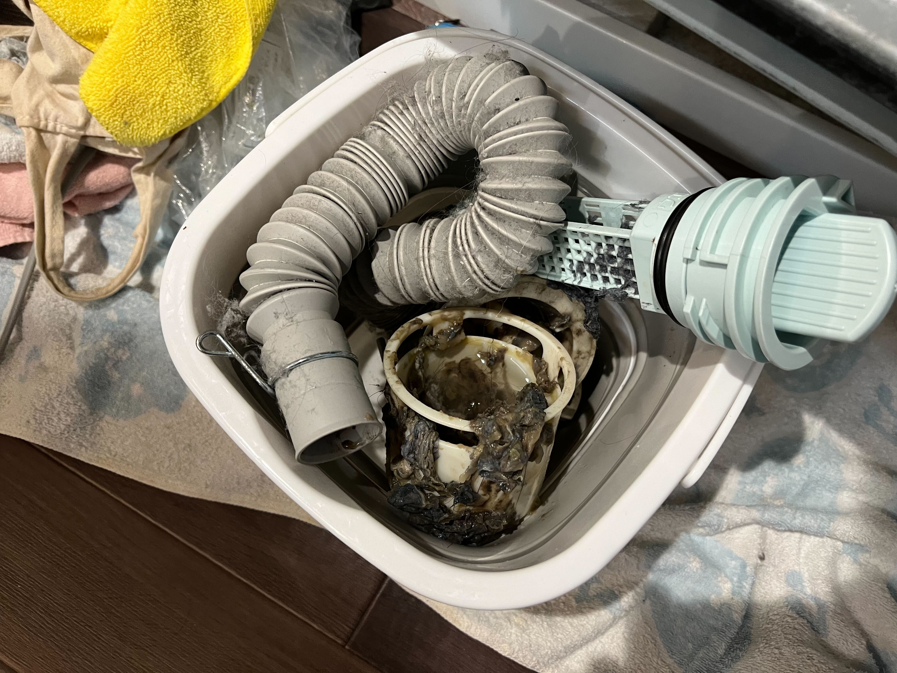
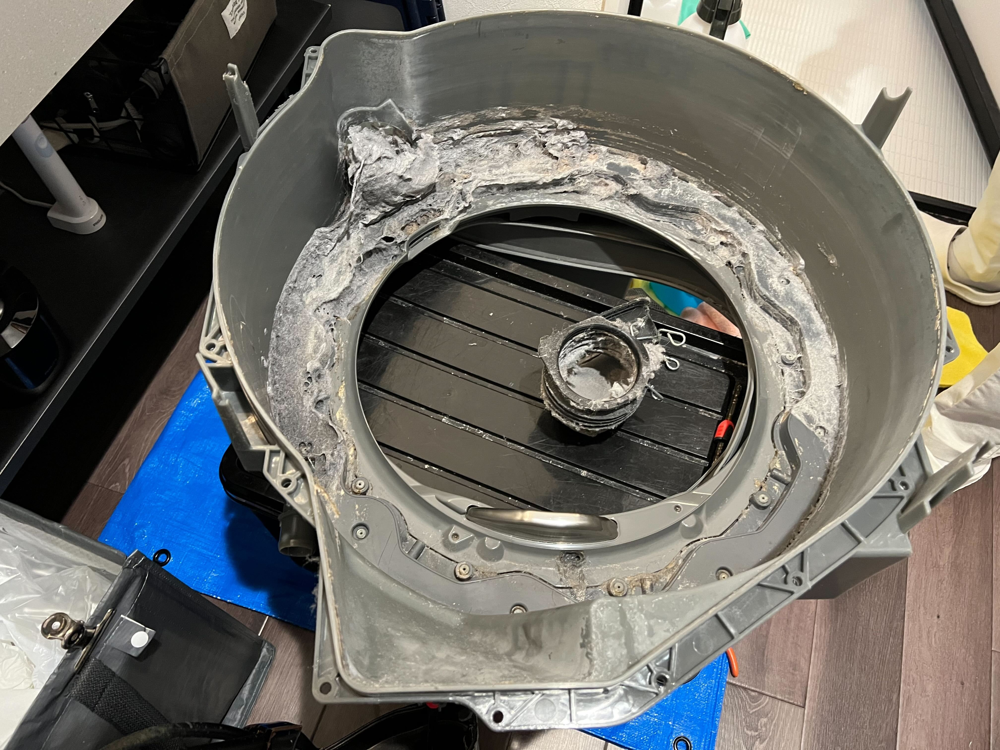
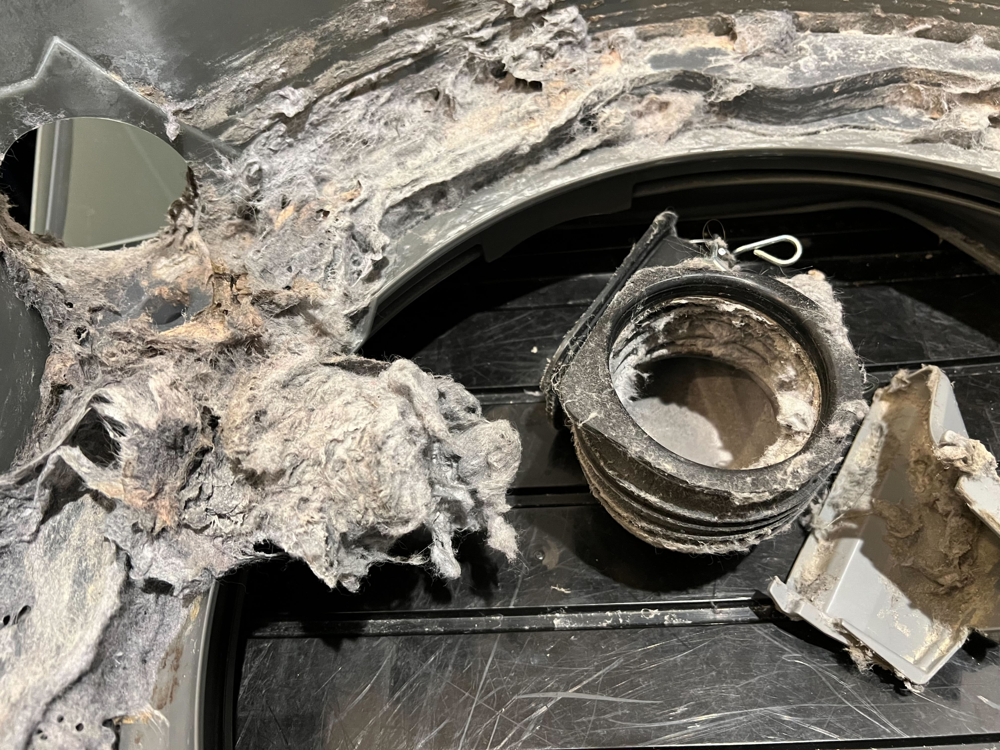

最近我が家のドラム式洗濯機の調子が悪くなっているのを感じていた。  
乾燥に時間がかかるし、乾燥が終わっても生乾きのことがちょいちょいあったり。そして極めつけは脱水中に防水パンの中に水が滲み出てきては排水口に消えていくといった感じで、まるで波のように排水が寄せては返すをしていたのを発見した。

我が家のドラム式洗濯機はもう7年選手くらいなのでさすがにまあこうもなるよな、ということで、清掃業者を呼んできれいにしてもらうことにした。

使ったサービスは[くらしのマーケット](https://curama.jp/)。  
去年、エアコンがあまりに汚かったときもくらしのマーケットで依頼してエアコン掃除をしてもらったんだけど、そのときの体験が良かったので今回も使わせてもらった。  
くらしのマーケットは、近所で評判の良い業者をパッと出してくれるので、失敗率の低そうな選択がハイスピードでできるみたいなところで気に入っている。

ということで清掃の様子を写真に残した。

ここからはとても汚い写真になるので折りたたんでいます。大丈夫な人だけ見てください。

ということで分解してみるとめちゃくちゃ汚かったです。  
定期的に洗濯槽の洗浄はしていたので洗濯槽のカビとかは全然なかったんだけど、ホコリの量がやばかった。  
毎日洗濯と乾燥をしていてそれが7年とか続いていたので、当然と言えば当然ですかね。

分解〜清掃〜戻しで大体3時間くらいの作業で、めちゃくちゃきれいになって良かった！  
今回来てくれた業者の方もめっちゃ丁寧だし親切だった。料金は28,000円で、ドラム式洗濯機の分解清掃としては多分相場通りだと思うので満足です。  
おわり。
