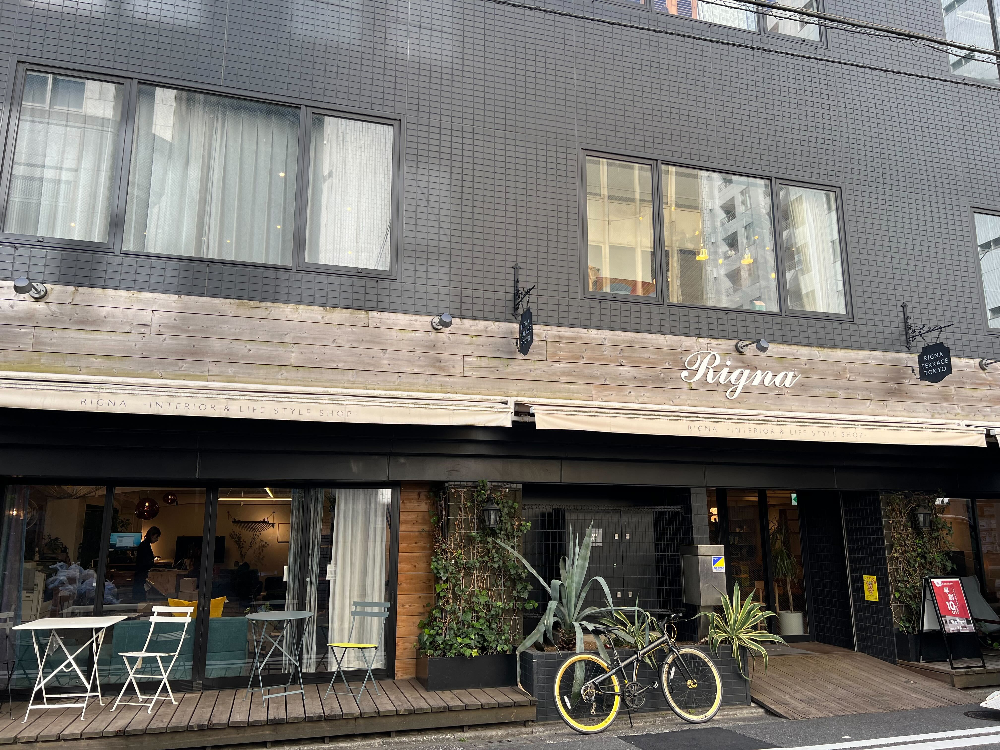
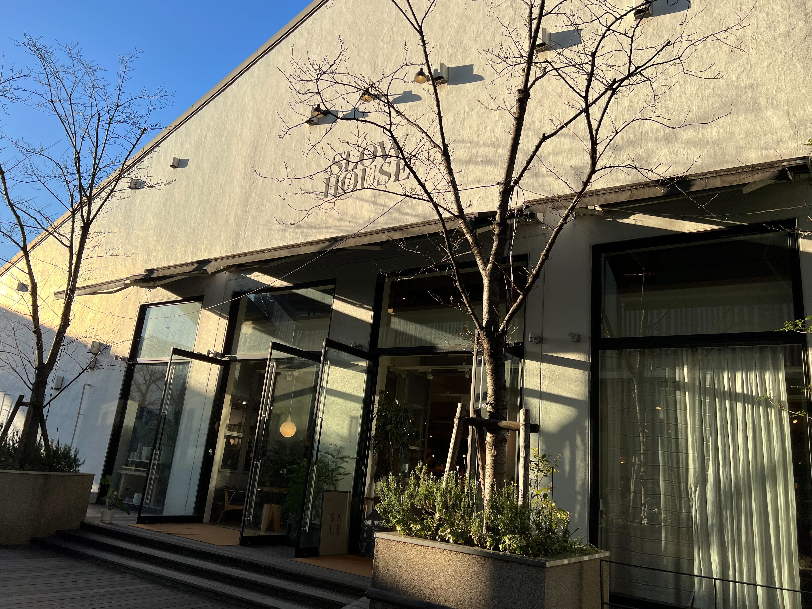
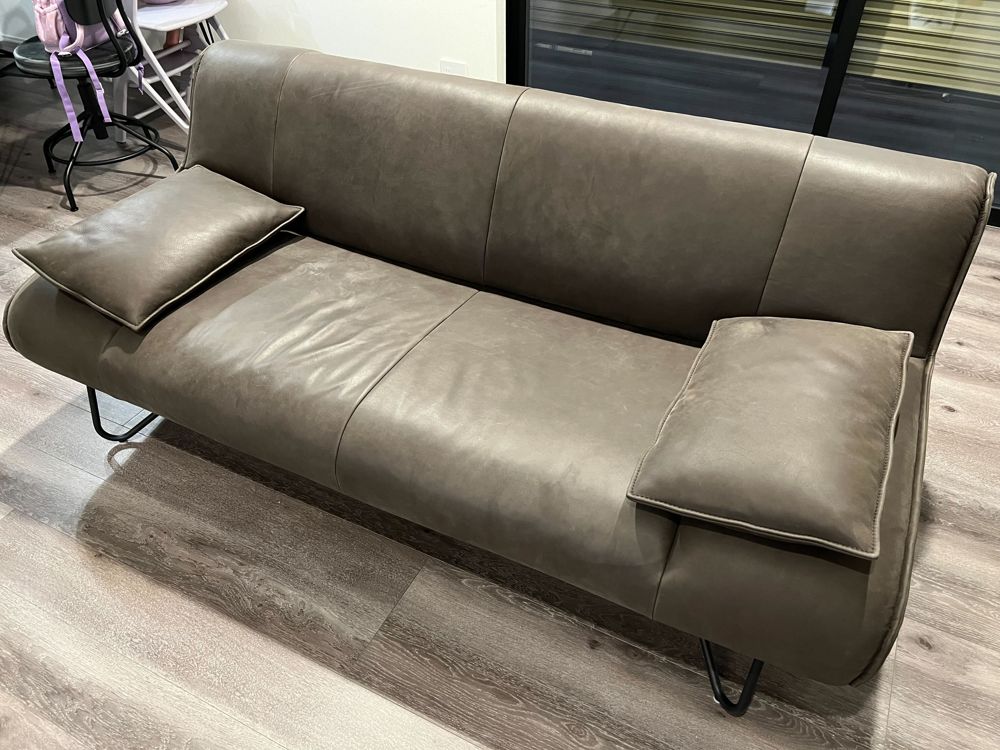

## 今月のトピック

### 2024年の行動指針を決めた

2024年が始まったので年初に今年の行動指針を決めた。  
その年のやりたいことリストみたいなのは去年から作らないようにしていて、何をやるべきかって迷ったときに判断軸になるような行動指針だけ作るようにしている。

内容に関しては特に外に出すつもりはないんだけど、とりあえず色々決まったので今年もやっていくぞということで。

### 実家でゆっくりした

年末年始は実家に帰っていた。  
滞在してたのは3日くらいで結構短かったんだけど、実家に帰ると毎回豪華な料理を用意してくれるし1日だらだらさせてくれるしでとても体が休まった。

あとは[北口本宮冨士浅間神社](https://www.sengenjinja.jp/)というところで初詣をした。

地元なので行き慣れているところなんだけど、久々に行くとめっちゃ厳かな感じで良いなってなった。

初詣ってなぜか屋台があって、娘とチョコバナナとりんご飴を食べられて久々の祭り感を味わえて満足した。

### ソファを買った

今の家を建ててからもう2年が経って、引っ越し当初はお金が底をついたので家具を揃える余裕がなかったので場当たり的な家具を揃えていた。  
そして最近はちょっと余裕が出てきたので妻と話して全力で家具選びをしていくかということになった。

ということでまずはソファを買うことにした。  
めっちゃ色んな店に行ってあーでもないこーでもないと言いながら理想のソファについて考えていた。

ちなみに行った店はこのあたり。

- [リグナテラス東京](https://rigna.co.jp/category/rigna)
- [SLOW HOUSE（スローハウス）](https://www.slow-house.com/)
- [KARE 青山店](https://www.livinghouse.co.jp/branch/kare-aoyama/)
- [niko and ... TOKYO](https://www.nikoand.jp/tokyo/)
- [アーバンドック ららぽーと豊洲](https://mitsui-shopping-park.com/lalaport/toyosu/)
  - [LIVING HOUSE. アーバンドックららぽーと豊洲店](https://www.livinghouse.co.jp/branch/toyosu/)
  - [アクタス・豊洲店](https://www.actus-interior.com/shop/toyosu/)
  - [ZARA HOME ららぽーと豊洲](https://zarahomeshop.biz/japan/toyosu.html)

もちろんウェブで探したりもした。

最終的に LIVING HOUSE というお店でセールになっていたソファを買うことにした。  
セールにはなっていたんだけど元値が信じられないくらい高くて30%オフだったんだけど、金額でいうと凄まじい値引き額だった。  
家具にこの額使うのは初めてで買うのに結構勇気が必要だったんだけどうちに届いたときはめっちゃテンションがあがった。

ただ現状ソファだけがしっかりしたものでそれ以外の家具が全部適当ということでソファがめっちゃ浮いてしまっているので、またしばらくしたら次はローテーブルでも全力探ししようと思う。

### いちご狩りに行った

娘は甘いものが大好きで特にいちごが好きなので、いちご狩りを体験させてあげようということで行った。  
娘は初めてのいちご狩りで、僕と妻は8年前に一緒に行ったときぶり。

行ったのはここで、家から車で1時間以内で行けた。  
[Kaneko Ichigo Farm – 金子苺園](https://kaneko-strawberry-farm.myshopify.com/)

いちごは3種類あって、ほしうらら・紅ほっぺ・かおり野というもので、最初はいちごの違いが自分にわかるはずがないと思ってたんだけど食べ比べてみると意外と全然違くて感動した。  
娘もひたすらに食べて喜んでくれていたので良かった。

### くらしのマーケットで依頼して洗濯機の掃除をしてもらった

ただ掃除機をきれいにしたというだけなんだけど個人的に衝撃だったのでトピックとして書いている。

詳しくはブログにしているのでそっちを見てくれ。  
[くらしのマーケットで依頼してドラム式洗濯機の清掃をした](https://blog.nabeliwo.com/2024/01/clean-washing-machine/)

### 社内の LT 会で発表した

昨年末から社内で月イチの LT 会が開かれるようになった。  
前回は参加自体ができなくてちょっと残念だったので今回は発表者として参加することにした。

発表内容としては、最近ずっと調査していた [Storage Access API](https://developer.mozilla.org/ja/docs/Web/API/Storage_Access_API) について、その技術仕様や実装の大変さ、そしてそれが社にどう関わってくるのか、みたいな話をした。  
発表の反応自体は良かったんだけど、社内向けだったので好き放題やった結果、スライドが権利関係的にあれで外に出せるような資料じゃなくなってしまったのでここに載せられないというのが一番の失敗だったかも。  
あとは5分って思ったより短くてつめつめで話すことになっちゃって周りの反応にあわせてしゃべるっていうことができなかったのも反省点。

次回以降発表者になれたら外に出せる発表をしようと思った。

### YouTube 活動

今月出せた動画は1つ。2024年のスタートから0本という事態は避けられて良かった…。

 [ロマンがすごい変態キーボード GrabShell！VR 作業の入力デバイスとしていかがですか？](https://www.youtube.com/watch?v=3Lks_G_DniU)

あと今までやってなかったこととしてショート動画もあげてみた。  
[変態キーボード GrabShell で寿司打を練習した結果](https://www.youtube.com/shorts/5BsxyUfzBjg)

今回の動画は、去年の末に GrabShell の会社から「商品を提供するのでレビューしてくれませんか」という連絡が来て、元々 GrabShell のことは知っていたのでテンションが上がって二つ返事でオッケーしたという経緯がある。

実際キーボードを受け取ってみると思いの外慣れるのが難しくて、でも適当な動画は出せないからがっつりタイピング練習したり GrabShell 開発のストーリーとか思いとか、あともちろん仕様もしっかり調査してから動画を作った。  
結果として12月頭にキーボードを受け取ったのに動画出したのが1月末になっちゃった。

ただ動画を出して GrabShell の方に動画を見せたらめっちゃちゃんと見てくれてしっかりと感想をくれて喜んでくれたので受けて良かったな〜〜となった。  
ただ再生数としてはそんなに伸びてはいないので、力になれてないことが申し訳なくなってショート動画でもあげて再生数増加を狙ってみるかという気持ちになって初のショート動画を撮ってみた感じ。

今日公開なのでまだ効果はわからないけど、普通の動画を公開したあとにその動画にまつわるショート動画をあげるって流れはわりと良さそうなので余裕があったら今後もやっていこうと思う。

## 良かったコンテンツ

- [UNIXという考え方―その設計思想と哲学](https://amzn.to/427TLyQ)
  - 僕がエンジニアになって学んできたことって UNIX の哲学だったのかってなった
- [物語思考 「やりたいこと」が見つからなくて悩む人のキャリア設計術](https://amzn.to/3RVKgxV)
  - けんすうさんの本
  - やりたいことがないわけではないんだけど、行動を起こすのが億劫になってしまっていたのでそういうのを解消できるのを期待して読んだんだけどとても良かった
  - 感想はこっちにちゃんと書いた
    - [『物語思考 「やりたいこと」が見つからなくて悩む人のキャリア設計術』を読んだ](https://blog.nabeliwo.com/2024/01/read-story-thinking/)
-  [読んでみてはラジオ](https://open.spotify.com/show/0Vv5Gs0DVYZsvAb4w4CthT?si=d38cefe97ec94369)
  - 自分が働いている会社の社長のコンテンツを持ち上げて褒めるのもなんだかなあという気もするんだけど普通に面白くて最新話が出るたびにすぐ聴いてる
- [マーベルズ](https://marvel.disney.co.jp/movie/marvels)
  - 公開したのは去年なんだけどタイミングが合わなくて見に行けず、ついに配信されたので見た
  - MCU 大好きなので絶対全部見るようにしていて、今作は特に面白かった
  - 興行収入は MCU の中でめっちゃ低いんだけど個人的には上位に入るくらいの面白さだった
- [Palworld / パルワールド](https://store.steampowered.com/app/1623730/Palworld/?l=japanese)
  - あまり大きな声で最高！とは言いづらいゲームではあるんだけど、ゲーム性として神がかっていて辞め時がわからないゲーム
  - 全ての時間を吸われるので僕は一旦封印した
