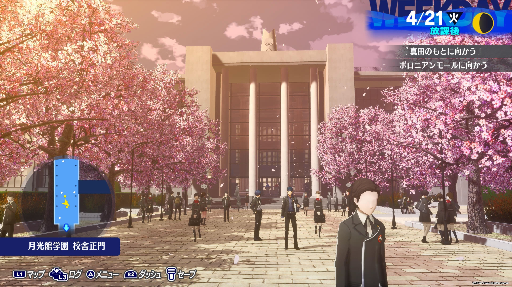
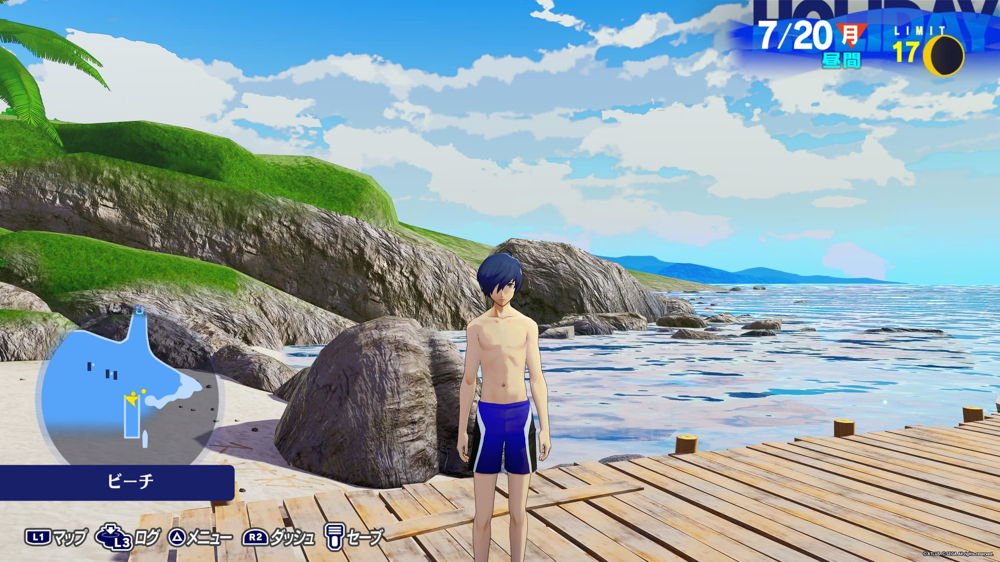

[ペルソナ３ リロード](https://p3re.jp/)というゲームをクリアしたので感想を書きます。  
ストーリーのネタバレはなしでいきます。

## プレイ記録

1週目クリアまでのプレイ時間としては91時間でした。  
PS5 のトロフィーで言うと46/49という感じで、あと3個トロフィー取ったらトロコンできるとこまで。このあと2週目やってトロコンを目指していきます。  
やり残しとしては MAX に持っていけてないコミュが3つあるのと裏ボスをまだ倒していないところの2つ。

発売してからほぼ毎日やってました。  
途中体調を崩してできなかったりした日がいくつかあったんだけど基本毎日子を寝かしつけしたあと3時くらいまでやってました。  
日常に影響が結構出ていて、仕事中眠くてぼぉーっとすることが多かったしなんなら高熱出したのも睡眠不足で免疫下がってるときに子が保育園から持ってきたウィルスを食らったんじゃないかと思っています。あまり同僚に見せられない話だこれ。

ちなみに自分は高校生のときに原作の方をやったんだけど、ペルソナ3 ポータブルとかはやっていないし劇場版も見ていないのでほぼ記憶が残っていなかったので、新鮮な気持ちでプレイできた。

## 感想

まず雑に感想を書いていきます。

最高のリメイクでした。あまりにも…最高…。  
半月の間ずーっとやっていたので今喪失感がやばい。神ゲーにしばらく熱中してそのゲームをクリアしてしまったときって本当に喪失感がやばくて発売日に戻りたくなって心に空いた穴があまりにも苦しくて死にたくなるんだけど、それが今起きています。

ペルソナ5のあの素晴らしいルックを3の世界でやってくれたのが本当に嬉しかった。  
ペルソナ5は実際にあるいろんな街を再現しているんだけど、ペルソナ3は港区にある架空の人工島が舞台になっていて、今やってみると結構狭いんだなってなった。

相変わらずキャラのモデルが良いのと総攻撃後のイラストのかっこよさでしびれまくっている。  
ペルソナ召喚するときって4だと眼鏡カッ！って感じで5だと仮面ブチッ！って感じなんだけど、3だと銃カッ！って感じで一番かっこいい。そして後ろのガラス割れる感じのエフェクトも良すぎて最高だった。(語感だけで感想を語っている…)

特にお気に入りなのがチドリがペルソナを召喚するところなんだけど、チドリのもともとのビジュアルの良さも相まってあまりにも良すぎる。なのにチドリの戦闘シーンはめっちゃ少ないのが悲しい。

ストーリーもよくできていて、ペルソナ5みたいにあまりにもわかりやすい勧善懲悪ものとはちょっと違うんだけど、「終わり」をテーマにしていて命であったり学生生活であったりいろいろな限りあるものを絡ませて限りある中でどうやって生きていくかというのをみんなが葛藤しつつ考えていく話で、社会人生活が10年以上経ってしまって特になんのメリハリもなく続いていく日々を漫然と生きている自分にめっちゃ刺さってしまった。  
終盤はご都合主義というかよくある感じでフィナーレに向かってくんだけど、その王道をしっかりやっていっていることにも好感が持てるしわかっていてもしっかり涙腺をやられてしまった。

あとはペルソナシリーズは恋愛要素もとても大事で、ペルソナ5とかはコミュで関わる人達の個性をめっちゃ強くしているんだけど3ではそこはそんなに強くなくて、幅広いキャラとの恋愛を楽しむみたいなのだとちょっと満足感が足りないんだけれど、3はメインキャラがまじであまりにもかわいいというのが良いところで、メインキャラの女性陣4人との絡みが素晴らしいのでそれだけで神ゲーになっている。  
正直4人とも良すぎて僕は推しキャラを決めきることができなくてこまっている。

## テーマソング

ペルソナ3には『キミの記憶』という、ゲームテーマソングランキングをやったら確実に上位に入るであろう素晴らしい曲があるんだけど、これが作品のいたるところでいろんなアレンジをされて流れていて、本当に作品通して雰囲気が良すぎる。  
そしてクリア後のエンドロールではそれがフルで流れるわけでもう涙ボロボロだった。

ペルソナシリーズの推しポイントはやっぱりそのおしゃれ BGM にあると思っているんだけど、特に3は本当に曲が良いのでクリア後に OST が作業用 BGM になるのは定められた運命だと思う。

## 犬・猫・子ども・ロボ

この作品は、犬とか猫とか子どもとかロボとか、僕の涙腺を刺激するテーマを扱ったストーリーが多くて、作中のイベントに出てくるおばあちゃんと猫の別れであるとか、仲の悪い夫婦とその子どもの行く末であるとか、ロボットが生きるということを考える話であるとか、そういうの一瞬で涙が出てくるのでしんどい。

そしてなによりもコロマルというワンちゃんですよ。  
コロマルがあまりにもかわいくてコロマルをパーティから外すことができない。自分がやりたい戦術としてコロマルを外したいタイミングとかあるんだけど連れてかない選択をしたときの「クゥウン…」という反応がやばすぎてやっぱり連れてくぅぅうう！ってなっちゃう。

特に必要ないのにコロマルを散歩に連れて行くイベントばっかりやってしまって、そのせいでコミュを全て達成することができなかったと言える。  
ペルソナシリーズは人間ステータス、コミュ、ダンジョンという3つの要素の絶妙なバランスで成り立っているんだけど、そこにコロマルとの散歩やグルーミングという別の要素が食い込んできてしまってつらかったというか最高だった。

## おわり

また興奮のままに思いついた感想を雑に並べるというまとまりも語彙もない感想記事を書いてしまったけど、とにかく神ゲーでした。  
まだ2ヶ月目だけど2024年を代表するゲームと言いたい気持ちです。
